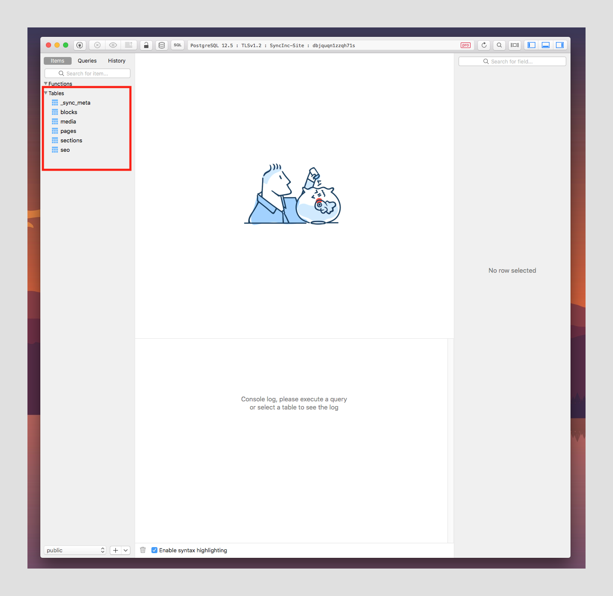

In the [previous article](https://dev.to/gsdev/build-a-splash-page-with-next-js-using-airtable-as-a-cms-1o7l) of this series, we built a splash page using the `Airtable.js` package to query our data from an Airtable base. We also took a deep dive into what Airtable actually is and how you can use `Next.js` to help generate static pages directly from your Airtable data.

Although the [previous article](https://dev.to/gsdev/build-a-splash-page-with-next-js-using-airtable-as-a-cms-1o7l) _<u>is not a pre-requisite</u>_ for following along in this article, but if you've never worked with Airtable before I highly recommend starting there to get a better idea of how we're using Airtable.

In this article, we'll take a step-by-step look at how to set up `SyncInc` and use it to synchronize your Airtable base with a fully provisioned cloud `Postgres` instance. We'll still be working with the same Airtable base, so in the end, you will end up with the same splash page. In contrast, you'll be able to see how `SyncInc` helps us simplify the logic required to achieve the same solution using the raw power of SQL to query your data from Airtable

If you followed along with the [first article](https://dev.to/gsdev/build-a-splash-page-with-next-js-using-airtable-as-a-cms-1o7l) in this series, then you already know how cumbersome it can be to query Airtable directly. Even when using the `Airtable.js` package, there's a ton of boilerplate that is required just to get our data from Airtable. Using `SyncInc` we not only get a more scalable solution but also a more efficient and performant way to get data from Airtable to the front-end of our applications.

## **What is SyncInc?**

`SyncInc` is a production-grade synchronization service used to create and synchronize a "_follower_" Postgres database with various third-party APIs.

### **Why SyncInc**

- Generous Free-tier
- Fully-provisioned cloud Postgres database hosted on AWS or co-located with an existing database
- Production-grade integrations like Shopify, Stripe, Twilio and of course Airtable.
- Automatic schema generation
- Single source of truth for multiple data sources
- All the advantages of postgres.

## Pre-requisites

- Basic understanding of Javascript(ES6) and React.
- General understanding of relational databases, SQL statements and joins.
- [System Requirements](https://nextjs.org/docs/getting-started#system-requirements)
  - [Node.js 10.13](https://nodejs.org/) or later
  - Either macOS, Windows (including WSL), or Linux

## Resources

[Airtable Base](https://airtable.com/shr5ukdwDwP7UHfXH) - This is the Airtable database you'll be working from.

[Starter Branch](https://github.com/gaurangrshah/next-airtable-splash/tree/post2-starter) - You can use this branch to clone the starter for this project and follow along.

[Final Branch](https://github.com/gaurangrshah/next-airtable-splash/tree/post2-final) - Use this branch to compare your work if you run into any issues.

[Codesandbox Starter](https://codesandbox.io/s/post1-starter-forked-bl6yr?file=/utils/data-helpers.js) - You can also follow along using this CodeSandbox starter project.

[Preview](https://next-airtable-splash-r2r0aixgx-gshah2020.vercel.app/) - This is a working demo of the end product of this article.

Before we get started, you'll need

- an Airtable account
- you'll need to clone the Airtable base provided above in the `Resources` section. You'll also need your Airtable API key handy, which [can be found here](https://airtable.com/account).

☝️ Once again, you can refer to the `Airtable Setup` section of the [last article](https://dev.to/gsdev/build-a-splash-page-with-next-js-using-airtable-as-a-cms-1o7l).

## SyncInc Setup

[Sign up](https://app.syncinc.so/signup) for a `SyncInc!` account or [log in to your existing account](https://app.syncinc.so/login).


If this is your first time signing up then click the button labeled "**Let's go**" to continue, otherwise, you'll be redirected to your dashboard.


For the next step, you'll need your `Airtable API key` from [here](https://airtable.com/account).

> ☝️ If you haven't set up your Airtable account or haven't cloned the Airtable base used for this project - please complete the setup using the directions provided in the `Airtable Setup` section of the [first article](https://dev.to/gsdev/build-a-splash-page-with-next-js-using-airtable-as-a-cms-1o7l).


If you've successfully cloned the provided Airtable base, should see a base named "site" listed in your available bases.


Make sure that you toggle "_Sync all tables in this base_" on and select "_New Sync Inc database_".


You'll be given a quick on-boarding questionnaire select the option that fits best for you or just click "**Skip**" to continue.


After a few moments, your new synchronized database will be fully provisioned. Once the setup completes you'll be provided with your credentials.


## Project Setup

Once you have access to your `SyncInc` credentials, you can turn your attention towards setting up the project locally.

Clone the starter branch, by running the following command.

```bash
git clone -b post2-starter https://github.com/gaurangrshah/next-airtable-splash.git
```

Navigate to the project directory.

```bash
cd next-airtable-splash
```

Install project dependencies.

```bash
yarn
```

Once your packages have been installed. Go ahead and spin up your development server and ensure that the application is running properly.

```bash
yarn dev
```

If all goes well you should see a page that looks similar to the one below.


Let's take a moment to familiarize yourself with this starter template. For the most part, this is a typical boilerplate `Next.js` application.

```bash
.
├── README.md
├── components
│   ├── Containers.js
│   ├── Cta.js
│   ├── Hero.js
│   ├── List.js
│   └── Splash.js
├── lib
├── next.config.js
├── package.json
├── pages
│   ├── _app.js
│   ├── api
│   │   └── hello.js
│   └── index.js
├── public
│   ├── favicon.ico
│   └── vercel.svg
├── styles
│   ├── Containers.module.css
│   ├── Cta.module.css
│   ├── Hero.module.css
│   ├── Home.module.css
│   ├── List.module.css
│   └── globals.css
├── utils
│   └── data-helpers.js
└── yarn.lock
```

You'll find that the starter also includes all of the styles and each of the components you'll need for this project including a few helper functions that will make handling the data a bit simpler.

## Connect to your Sync Inc Database

Next up we'll look at how to get our data into our application from Airtable. We'll start by using the [pg](https://www.npmjs.com/package/pg) package to connect with and query from our synchronized Postgres database that we generated with `Sync Inc`.

In the [last article](https://dev.to/gsdev/build-a-splash-page-with-next-js-using-airtable-as-a-cms-1o7l), we used the `Airtable.js` package to help query our Airtable data, this time around we'll use the [pg](https://www.npmjs.com/package/pg) package to help do the same with our Postgres database. You should see a stark contrast in both the amount of boilerplate you no longer need and how we can simply all of the logic we implemented previously into a single SQL statement which will return all of the data we need.

Let's start by adding `pg` as a dependency by running the following command:

```bash
yarn add pg
```

> `pg` allows us to interact with postgres databases from `node.js` environments using the full power of raw SQL queries. Alternatively, `pg` is often known as `node-postgres`
>
> 📒 More about [pg](https://node-postgres.com)

Next, you'll need to set up your environment variables to configure your `SyncInc` database.

From your `SyncInc` dashboard click the "**Connect**" button.


You'll need to fill in the corresponding values from the credentials tab of the `SyncInc` dashboard.


Create a new file called `env.local` at the root of your project and copy the variables below:

```
# .env.local

DB_USER=
DB_HOST=
DB_NAME=
DB_PW=
DB_PORT=
```

— see `.env.sample` file included with the starter for this project.

— see more on [environment variables in Next.js](https://nextjs.org/docs/basic-features/environment-variables)

With your environment variables defined, you can now set up your database client. Create a new file under the `/lib` directory named `pg.js`.

```jsx
// lib/pg.js

const { Client } = require("pg");

// create client instance
const client = new Client({
  user: process.env["DB_USER"],
  host: process.env["DB_HOST"],
  database: process.env["DB_NAME"],
  password: process.env["DB_PW"],
  port: process.env["DB_PORT"],
});

module.exports = {
  client,
};
```

## Query Your Synced Database

Once you've instantiated the database client, the next step is to create the SQL query you'll need to grab all of your Airtable data that your application needs all at once.

> ☝️ **Be forewarned**, the query example below may seem a bit verbose, but that is really because we're not only querying for all of our data at once, but we're also explicitly renaming all of our fields at the same time.

```sql
SELECT /* Select and rename each field accordingly */
    p.id AS page_id,
    p.title AS page_title,
    p.path AS page_path,
    p.order_ AS page_order,
    p.sectionid As page_sections_id,
    p.seoid AS page_seo_id,
    s.id AS section_id,
    s.title AS section_title,
    s.order_ AS section_order,
    s.type AS section_type,
    s.filter AS section_filter,
    s.blockid AS section_block_id,
    s.pageid AS section_page_id,
    b.id AS block_id,
    b.title AS block_title,
    b.lead AS block_lead,
    b.excerpt AS block_excerpt,
    b.content AS block_content,
    b.mediaid AS block_media_id,
    b.sectionid AS block_section_id,
    m.id AS media_id,
    m.title AS media_title,
    m.url AS media_url,
    m.alt AS media_alt,
    m.blockid AS media_block_id,
    m.seoid AS media_seo_id,
    seo.id AS seo_id,
    seo.title AS seo_title,
    seo.description AS seo_description,
    seo.keywords AS seo_keywords,
    seo.sitename AS seo_sitename,
    seo.url AS seo_url,
    seo.mediaid AS seo_media_id,
    seo.pageid AS seo_page_id
FROM
    pages AS p /* target table */

		/* match data from different tables  data by id */
    LEFT JOIN seo ON seo.id = ANY (p.seoid)
    LEFT JOIN sections AS s ON s.id = ANY (p.sectionid)
    LEFT JOIN blocks AS b ON b.id = ANY (s.blockid)
    LEFT JOIN media AS m ON m.id = ANY (b.mediaid)
    ORDER BY p.id ASC, s.order_ ASC;
```

> NOTE: You could just as easily rename the fields in your Airtable base, and reduce the bulk of the query logic. But it's important to understand how to coerce data into the shape required by your application since you may not always have control over how the data is provided.

## Table Plus Setup

At this point it may be a good idea to test this query by running it against your database from any database admin software. You can find many free/freemium tools (i.e., [SequelPro](https://www.sequelpro.com), [Postico](https://eggerapps.at/postico/), [DBeaver](https://dbeaver.io/download/)), although we'll be using [TablePlus](https://tableplus.com/download), because it's extremely simple to use with a great UI.

TablePlus is an extremely powerful utility that you can use with almost any type of database, it's definitely a great tool to have in your repertoire.

But for our purposes we'll only be using it to test the query we wrote above against our database to ensure we're getting back the correct data.

Start by downloading [TablePlus](https://tableplus.com/download).

Once your download completes double click on the file and install the application.

> The installer should guide you through the process with instructions relevant to your platform.

Once the installation completes open `TablePlus` and click the "**Create a new connection**" link at the bottom of the window.


Next click the "**Import from URL**" button.


Then inside the dialog enter your postgres connection URL and click the "**Import**" button

> ☝️**NOTE:** You can find the connection URL in your `SyncInc` dashboard as shown below:
>
> 

Next you can name your new connection and then click the "**TEST**" button to test your connection. If successful you should see all of the fields from your connection configuration turn green.


Once your connection test passes, you can feel free to click the "**Connect**" button, this will open of the default application view.



You should see all of your tables from your Airtable base listed in the left sidebar. You can click on any one and browse through your data.

But for now we simply want to run a quick query against our data. To do that click the "**Queries**" tab at the top fo the left sidebar.


Then right-click to create a new folder called "**syncinc**".

Then right -click on the new "**syncinc**" folder and create a new file. The new file will open in its own window.


Rename the file, and then paste in the SQL query we constructed.

You can the close the file and double-click on it from the sidebar. This will open the query in the editor.


Now you can simply click the button labeled "**Run Current**". You'll see the data returned almost instantly as shown above.

> **NOTE:** Because of how a `LEFT JOIN` works each row also has duplicated data regarding the `page` that it is related to. Since there is only a single `page` record in your Airtable base, the data is identical for each instance. This is the expected behavior and we'll deal with transforming this data further to fit our application's needs during the build step.
>
> ☝️ More about [Postgres Left Joins](https://www.tutorialspoint.com/sql/sql-left-joins.htm)

**ALSO NOTE:** If you look at the data closely you'll notice that your query returns one row for each `block` in your Airtable base.


Now that you know the query logic works let's take the query and create a reference to it so we can use it within our application.

Let's create a new file called `queries.js` in `lib/queries.js`and construct our query in this file.

```sql
// lib/queries.js

export const SECTIONS_QUERY = `SELECT
      p.id AS page_id,
      p.title AS page_title,
      p.path AS page_path,
      p.order_ AS page_order,
      p.sectionid As page_sections_id,
      p.seoid AS page_seo_id,
      s.id AS section_id,
      s.title AS section_title,
      s.order_ AS section_order,
      s.type AS section_type,
      s.filter AS section_filter,
      s.blockid AS section_block_id,
      s.pageid AS section_page_id,
      b.id AS block_id,
      b.title AS block_title,
      b.lead AS block_lead,
      b.excerpt AS block_excerpt,
      b.content AS block_content,
      b.mediaid AS block_media_id,
      b.sectionid AS block_section_id,
      m.id AS media_id,
      m.title AS media_title,
      m.url AS media_url,
      m.alt AS media_alt,
      m.blockid AS media_block_id,
      m.seoid AS media_seo_id,
      seo.id AS seo_id,
      seo.title AS seo_title,
      seo.description AS seo_description,
      seo.keywords AS seo_keywords,
      seo.sitename AS seo_sitename,
      seo.url AS seo_url,
      seo.mediaid AS seo_media_id,
      seo.pageid AS seo_page_id
    FROM
      pages AS p
      LEFT JOIN seo ON seo.id = ANY (p.seoid)
      LEFT JOIN sections AS s ON s.id = ANY (p.sectionid)
      LEFT JOIN blocks AS b ON b.id = ANY (s.blockid)
      LEFT JOIN media AS m ON m.id = ANY (b.mediaid)
      ORDER BY p.id ASC, s.order_ ASC
    `;
```

You can then import the query into the same file that you defined the database client in `/lib/pg.js` and create a function called `getSections()` that you can use to query against your Postgres database directly from your application.

```jsx
// lib/pg.js

import { SECTIONS_QUERY } from "./queries";

/*

truncated...

*/

async function getSections() {
  try {
    await client.connect(); // connect to db

    // query database for sections and all related data.
    const res = await client.query(SECTIONS_QUERY);

    // handle success
    // console.log("res--", res);
    await client.end(); // close connection to db

    return res;
  } catch (err) {
    // handle errors
    console.error(err);
  }
}

module.exports = {
  client,
  getSections,
  SECTIONS_QUERY,
};
```

That's it. That's all the logic we need to query all of our data from Airtable. You might recall from [the first article](https://dev.to/gsdev/build-a-splash-page-with-next-js-using-airtable-as-a-cms-1o7l), that it took a lot more work to query the same data using `Airtable.js`. This is the power of `Postgres` on full display with the help of `SyncInc`. As you can see we've significantly decreased the development time. And because we're dealing with `Postgres` we also have the full benefit of it's plugin eco-system and third-party utilities (like `TablePlus`).

Next, let's put our logic to work in our application by ensuring that `getSections()` is called asynchronously at build time using `getStaticProps()`.

> ☝️ You might recall from [the last article](https://dev.to/gsdev/build-a-splash-page-with-next-js-using-airtable-as-a-cms-1o7l), that `getStaticProps()` will get called once at build-time for each top-level page in your application. So any logic we have within it will be run once during the build process. That data is then cached and used to generate the content for each of the static pages in your application. In our case, we just have a single page.

```jsx
// pages/index.js

import Head from "next/head";

import { removeNullValues } from "../utils/data-helpers";
import styles from "../styles/Home.module.css";

export default function Home({ rows }) {
  return (
    <div className={styles.container}>
      <Head>
        <title>Create Next App</title>
        <link rel='icon' href='/favicon.ico' />
      </Head>

      <main className={styles.main}>
        <h1 className={styles.title}>
          Welcome to <a href='https://nextjs.org'>Next.js!</a>
        </h1>
        <div style={{ maxWidth: "80%", margin: "0 auto" }}>
          {JSON.stringify(rows, null, 2)}
        </div>
      </main>
    </div>
  );
}

export async function getStaticProps() {
  // asynchronously import getSections to avoid any client side evaluation.
  const { getSections } = await import("../lib/pg");

  const response = await getSections();

  // removes any fields with empty or undefined values to avoid any serialization errors
  const rows = removeNullValues(response?.rows);

  return {
    props: {
      rows, // return data as props.
    },
  };
}
```

With this in place, you should now be able to see something that matches the image below where you're simply dumping all of the data to the screen to make sure you're able to view the data on the front-end of the application.


You probably noticed that we used a function called `removeNullValues()` in `getStaticProps()`. `removeNullValues()` is a helper function that was included in the starter. It actually uses another one of our helper functions `isEmpty()` to find and any empty, `null`, or `undefined` values from our data.

```jsx
// utils/data-helpers.js

export function removeNullValues(arr) {
  return arr?.map((obj) => {
    Object.keys(obj)?.forEach((key) => {
      if (isEmpty(obj[key])) delete obj[key];
    });
    return obj;
  });
}

export function isEmpty(value) {
  return (
    value === undefined ||
    value === null ||
    (typeof value === "object" && Object.keys(value).length === 0) ||
    (typeof value === "string" && value.trim().length === 0)
  );
}

export function groupBy(arr, key) {
  return arr.reduce(function(rv, x) {
    (.rv[x[key]] = rv[x[key]] || []).push(x);
    return rv;
  }, {});
};

export function Section(data) {
  return {
    id: data?.section_id || "",
    title: data?.section_title || "",
    order: data?.section_order || "",
    type: data?.section_type || "",
    filter: data?.section_filter || "",
    block: {
      id: data?.block_id || "",
      lead: data?.block_lead || "",
      title: data?.block_title || "",
      excerpt: data?.block_excerpt || "",
      content: data?.block_content || "",
      media: {
        id: data?.media_id || "",
        title: data?.media_title || "",
        alt: data?.media_alt || "",
        url: data?.media_url || "",
      },
    },
  };
}
```

## Build the site

Now that you have your data and you're able to view it on the front-end, you can now use it to render the components that were provided with your project starter.

## SEO and Metadata

But before we render any of the components, you'll see that we are able to grab the SEO metadata we need for our page from our Airtable data. We use a reference to the first `row` from our data in order to grab all of the fields we need.

> ☝️ Recall: each row has this same data available to it, we could've used any of the rows from our data and we'd get the same data because we are only rendering a single page.

```jsx
// pages/index.js

import Head from "next/head";

import { Splash } from "../components/Splash";
import { removeNullValues } from "../utils/data-helpers";

import styles from "../styles/Home.module.css";

export default function Home({ rows }) {
  return (
    <div className={styles.pageWrapper}>
      <Head>
        <title>{rows[0]?.seo_title}</title>
        <meta name='viewport' content='initial-scale=1.0, width=device-width' />
        <meta name='description' content={rows[0]?.seo_description} />
        <meta property='og:title' content={rows[0]?.seo_title} />
        <meta property='og:site_name' content={rows[0]?.seo_sitename} />
        <meta property='og:url' content={rows[0]?.seo_url} />
        <meta property='og:description' content={rows[0]?.seo_description} />
        <meta property='og:image' content={rows[0]?.url} />
        <link rel='icon' href='/favicon.ico' />
        <link rel='cannonical' href={rows[0]?.url} />
      </Head>

      <main className={styles.main}>
        <Splash data={rows} />
      </main>
    </div>
  );
}

export async function getStaticProps() {
  const { getSections } = await import("../lib/pg");

  const response = await getSections();
  const rows = removeNullValues(response?.rows);

  return {
    props: {
      rows,
    },
  };
}
```

Then, let's take a closer look at the `Splash` component that is responsible for rendering all of that data. You'll notice that we do some data wrangling here to create a new `Section` from the data using a `Section()` factory function that takes in our raw data and returns the data shaped exactly as our application expects.

You can then render the `Hero` section separately by restructuring it off of the new array of `sections`. And then you can group the remaining `sections` by their `type` so we can render them with the appropriate component for each, based on those types.

```jsx
// components/Splash.js

import { Container, Wrapper, Row } from "./Containers";
import { Hero } from "./Hero";
import { List } from "./List";
import { Cta } from "./Cta";
import { groupBy, Section } from "../utils/data-helpers";

// components to be used for rendering Airtable data
const components = {
  list: List,
  cta: Cta,
};

export const Splash = ({ data }) => {
  if (!Array.isArray(data)) return null;

  // transform Airatble data
  const sections = data.map((section) => {
    return new Section(section); // create section from queried data
  });
  const [hero, ...rest] = sections;
  const restSections = rest?.length ? groupBy(rest, "type") : rest;

  return (
    <Wrapper>
      <Container>
        {hero && (
          <Hero
            key={hero?.block?.id}
            data={hero?.block}
            filter={hero?.filter}
          />
        )}
        <Row>
          {Object.keys(restSections)?.map((key, i) => {
            const Component = components[key]; // component to use for rendering
            const section = restSections[key]; // section to be rendered
            return (
              <Component
                key={`section-${section[i]?.block?.id}`}
                data={section}
              />
            );
          })}
        </Row>
      </Container>
    </Wrapper>
  );
};
```

With this in place, your template is complete, and all of our components for the `Splash` page will render according to their data. We'll step through each one in a bit of detail, but this should be nothing new to anyone who's worked with `React` before.

The `Hero` component simply renders the headline and some additional copy as well as a large hero image.

```jsx
// components/Hero.js

import styles from "../styles/Hero.module.css";
import Image from "next/image";

export const Hero = ({ data }) => {
  return (
    <div className={styles.hero}>
      <div className={styles.heroContent}>
        <p className={styles.lead}>{data?.lead}</p>
        <h1 className={styles.heading}>{data?.title}</h1>
        <p className={styles.excerpt}>{data?.excerpt}</p>
      </div>
      {data?.media && (
        <div className={styles.heroImage}>
          <Image
            layout='intrinsic'
            src={data?.media?.url[0]}
            alt={data?.media?.alt}
            objectFit='fill'
            width={600}
            height={600}
          />
        </div>
      )}
    </div>
  );
};
```

The `List` component renders our features & benefits and uses a `filter` we defined in Airtable to render each with its corresponding icon.

```jsx
// components/Lists.js

import Image from "next/image";
import styles from "../styles/List.module.css";

export const List = ({ data }) => {
  return (
    <ul className={styles.list}>
      {data?.map((section) => {
        const { block } = section;
        return (
          <ListItem
            key={block?.id}
            className={styles.listItem}
            img={block?.media}
            data={data}
            style={{ order: block }}
          >
            {block?.title}
          </ListItem>
        );
      })}
    </ul>
  );
};

export const ListItem = ({ img, data, children }) => {
  return (
    <li className={styles.listItem}>
      {data[0].filter[0] === "withIcons" && (
        <span className={styles.icon}>
          <Image
            layout='intrinsic'
            src={img?.url[0]}
            alt={img?.alt}
            width='28px'
            height='28px'
          />
        </span>
      )}
      {children}
    </li>
  );
};
```

Lastly, we have the `Cta` component that renders an email sign-up form. Once again we use the `filter` field to only include the form when the `withForm` value is present.

```jsx
// components/cta.js

import styles from "../styles/Cta.module.css";

export const Cta = ({ data }) => {
  const handleSubmit = (e) => {
    e.preventDefault();
    const input = e.target.querySelector("input");
    console.log(input.value);
  };

  return (
    <div className={styles.cta}>
      {data?.map(({ block }, i) => {
        return (
          <div key={block?.id}>
            <h2>{block?.title}</h2>
            <p>{block?.excerpt}</p>
            {data[i]?.filter.includes("withForm") && (
              <form onSubmit={handleSubmit}>
                <div className={styles.inputGroup}>
                  <input
                    type='email'
                    placeholder='you@youremail.com'
                    required
                    className={styles.input}
                  />
                  <div className={styles.inputRight}>
                    <button type='submit' className={styles.submit}>
                      Sign up now
                    </button>
                  </div>
                </div>
              </form>
            )}
          </div>
        );
      })}
    </div>
  );
};
```

## Summary

That's it, you've successfully created a splash page using data from your Airtable base, but by querying it from a synchronized Postgres database provided by `SyncInc`.

If all goes well, you should see something similar to the `CodeSandbox` example below:

<iframe src="https://codesandbox.io/embed/post2-final-cymmw?fontsize=14&hidenavigation=1&theme=dark&view=preview" height="600px" />

[CodeSandbox Preview](https://codesandbox.io/embed/post2-final-cymmw?fontsize=14&hidenavigation=1&theme=dark&view=preview)

If you followed along with both articles so far then the differences between each approach should be pretty evident. But in case it's not let's take a look at some of the pros and cons of using `SyncInc` to query your Postgres data.

### Pros

- Less overhead to query to data from Airtable.
- More powerful query syntax with raw SQL.
- Much more flexibility - use any O.R.M. that works with Postgres.
- Faster, more efficient and cleaner codebase.
- Take advantage of all available Postgres features.

### Cons

I can only think of one cons here and it's not much of a deal-breaker in my opinion. It has to do with the way follower databases work in general. Follower databases maintain uni-directional sync with a leader database. With Airtable that means our `SyncInc` database will always stay in sync with Airtable, but if we add data via Postgres, then Airtable will have no record of that change. This is why in general all changes are usually made to the leader database (Airtable) directly and updates are then synced using `SyncInc` to your follower Postgres database.

Although the great people over at `SyncInc` have also anticipated this and provided a way of writing back to your Postgres database using a Proxy. So you can still use SQL to implement any `CRUD` functionality that your application will need. This allows you to write back to both your Airtable base and your Postgres database instantly using `Airtable.js` or even the built-in `fetch` API.

> For more on [SyncInc Proxy writes](https://docs.syncinc.so/airtable/reference#writes)

That's it for this article, I hope you'll check out the third and final installment in the Airtable as a CMS series, where we'll go one step further and take a look at how you can "Build a Landing Page with Airtable as a CMS".

And be sure to follow me on [twitter: @soham_asmi](https://links.gshahdev.com/soham_asmi) to stay up to date with my latest projects and posts. Also, please feel free to reach out to me with any questions you may have along the way.

Until next the next one... 👋
