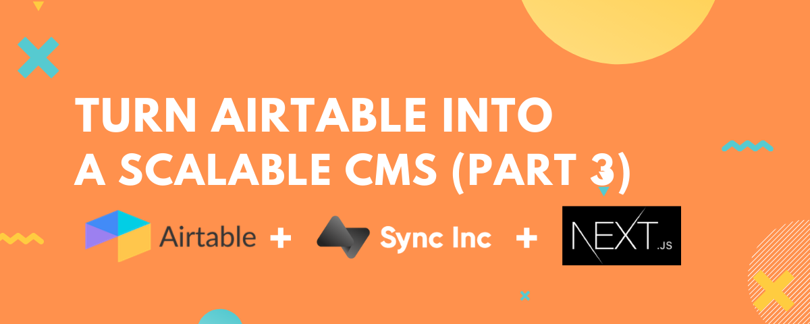


## Introduction

If you've been following along with [this series](https://gsdev.hashnode.dev/series/airtable-cms), then you've come a long way. You've already mastered the essential tools and skills required to integrate Airtable as a CMS into your projects.

So before we go further, let's recap everything we've accomplished so far, shall we?


## ♻️ Recap

**Airtable**

We explored what Airtable is, and how you can use it to manage all types of data and content. 

We explored the structure of Airtable and some of its core concepts such as `bases`, `tables`, `records`, `fields`. We discussed the role of `foreign` and `private` key relationships and how they're implemented under the hood in Airtable. 


**Next.js**

We explored data-fetching strategies in Next.js and employed "static site generation" (SSG) technique to generate a fully optimized static splash page with SEO and image optimization support.

Initially using the [airtable.js](https://github.com/airtable/airtable.js/) package we statically generated a splash page that pulls data from Airtable directly to the page.


**Sync Inc**

After seeing first-hand how cumbersome it is to use the **airtable.js** package in the [second article](https://gsdev.hashnode.dev/build-a-splash-page-with-syncinc-and-nextjs-using-airtable-as-a-cms) we reached for a more scalable solution in the form of a cloud Postgres Instance synchronized with our Airtable base using **[SyncInc](https://www.syncinc.so/)**.

This allowed us to use the [**node-postgres**](https://node-postgres.com/) package to query data from the synchronized Postgres database using raw SQL. This move not only reduced our application overhead but also helped reduce the amount of boilerplate we needed to write to achieve the same solution while significantly improving our infrastructure. With the power of a fully-provisioned Postgres instance, we now have a lot more room for scaling our application if and when it becomes necessary.

So in the end you now have an **Airtable** base doubling as a CMS to manage all of your content. Using **SyncInc** you were able to effortlessly synchronize your **Airtable** base with a fully provisioned **Postgres** database, which you can now query data from using raw **SQL**. And of course, you implemented lightning-fast static site generation using **Next.js** for optimized page builds. 


> ⚠️ **NOTE:** If you're just stumbling upon this article, and much of this sounds unfamiliar to you I suggest starting at the beginning with the [first article](https://gsdev.hashnode.dev/build-a-splash-page-with-nextjs-using-airtable-as-a-cms), as we cover many of these concepts in much greater detail. In either case, feel free to comment below with any questions or issues you may have! 

In this article, we'll expand upon everything you've learned so far, and see how we can use those newfound skills to build an entire landing page. We'll also introduce some different techniques to explore our capabilities a bit further.


### Prerequisites

- Basic understanding of Javascript(ES6) and React.
- General understanding of relational databases, SQL statements, and joins.
- [System Requirements](https://nextjs.org/docs/getting-started#system-requirements)
  - [Node.js 10.13](https://nodejs.org/) or later
  - Either macOS, Windows (including WSL), or Linux


### The Brief

Our client is extremely happy with the work we've done so far. They've come back to us to build out their first landing page, but they're new to content generation and are not sure what to include. They don't have a budget for copywriters at the moment so our team has introduced a novel solution.

We've offered to build out a landing page, fully generated with placeholder content that gives them a better idea of what information they should include and where on the page it makes the most sense. We're essentially providing them with a template where they can fill in the blanks. 

We've ensured that all the client has to do is open up their Airtable and replace our placeholder content with their own relevant content. Our placeholder content not only acts as a placeholder but also provides useful guidance and insights into what kind of content needs to be included for each section on the page. 

We've also made sure to include [many of the elements that make up a high-converting landing page](https://digitalshiftmedia.com/ultimate-20-point-landing-page-checklist/#:~:text=The Ultimate 20-Point Landing Page Checklist 1 One,... 9 Trust Icons. ... More items... ) to give our client a better chance of success.


## Project Goal

Our goal for the purpose of this article is to build out the front-end of the landing page using the placeholder content that has been generated in Airtable.

By the end of this article, you'll have built out an entire landing page using only the data from your Airtable base. And just like in the previous articles, we'll be using Next.js to statically render our page so that we can take advantage of its best-in-class SEO support and image optimization.

So before we jump in, let's take a quick look at [what we'll be building](https://tinyurl.com/at-cms-p3-final). 👀


## Resources

- [Airtable Base](https://tinyurl.com/AT-post3-base) - This is the Airtable database you'll be working from.

- [Starter Repo](https://tinyurl.com/post3-starter) - You can use this repo to clone our starter and follow along.

- [Finished Branch](https://tinyurl.com/post3-final) - Use this repo to compare your work if you run into any issues.

- [Project Demo](https://tinyurl.com/post3-final-preview) - This is a working demo of the Splash page project for this project.

- [CodeSandbox Starter](https://codesandbox.io/s/post3-starter-8tq4d) - You can also follow along using this CodeSandbox starter project.


## Airtable Setup

> ☝️ In order to facilitate the new requirements for building out a landing page, we've made some changes to the underlying **Airtable** base. 


Let's start by cloning this new base into your Airtable account. 

1. [Create an Airtable account](https://airtable.com/signup) or [sign in to your Airtable account](https://airtable.com/login).

2. Then [click here to Clone the Airtable base](https://tinyurl.com/AT-post3-base) you'll be using for this project.


### Airtable Credentials

Once you've cloned your base, you'll need both your Airtable `API key` and `base-id` to configure your application.

> ⚠️  **NOTE:** Your API key should be treated as a secret and should be kept confidential. The base-id is semi-private, but for this project, we'll be treating it as a secret as well.

> ☝️ If you're unsure of how to get your credentials, check out the "**Airtable Credentials**" section from the [first article](https://gsdev.hashnode.dev/build-a-splash-page-with-nextjs-using-airtable-as-a-cms).

Once you have your Airtable credentials, let's take a look at the new structure of our Airtable data before we move on to building out the Next.js application.


### Airtable Data Overview

The diagram below should look familiar to you, we went over it in detail in the [first article](https://gsdev.hashnode.dev/build-a-splash-page-with-nextjs-using-airtable-as-a-cms). The red highlighted areas represent additions to the original data structure.

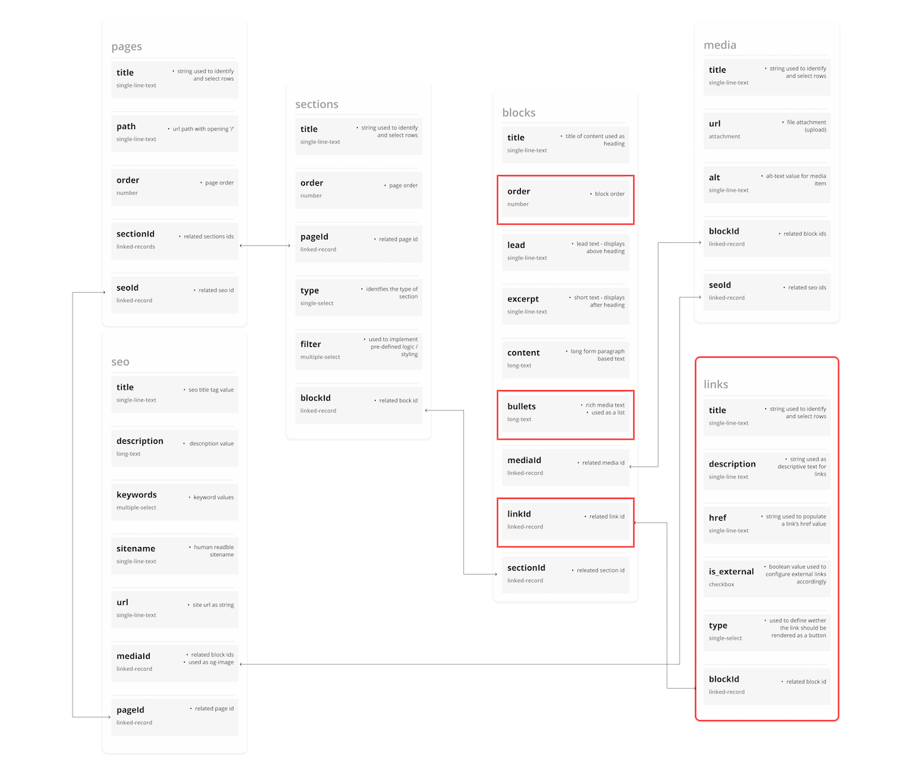

> ☝️The biggest change you'll notice is the addition of a new `links` table to help manage all of the links on our landing page.  

> Also notice that there are two new fields on the `blocks` table. The first, named `order`, is used to primarily ensure a stringent sequence when rendering several `blocks` within a single section as we'll soon be doing for all of our unordered bulleted lists.


#### Rich-Text Field

You'll also notice a new content field called `bullets` which is implemented as `rich-text` (Rich-Text is a sub-option available to any `long-text` type field). 

Airtable implements `rich-text` as markdown under the hood, because this allows us to use this field type to render more complex nested content. In our case, we'll use the `bullets` `rich-text` field to render unordered bulleted lists. 

> For more about `rich-text` fields in Airtable see: [Enabling rich-text](https://support.airtable.com/hc/en-us/articles/360044791433-Enabling-rich-text-in-the-long-text-field)

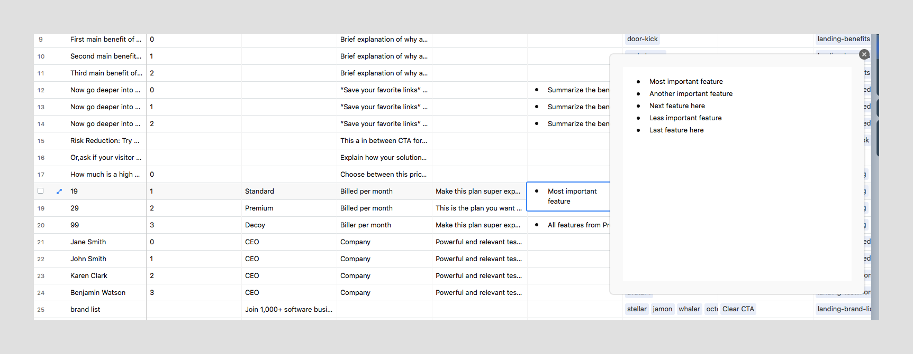

> 🚧  If any of the information or terminology presented above seems ambiguous to you at all then I highly recommend taking some time to review the [first two articles](https://gsdev.hashnode.dev/series/airtable-cms) in this series, where we discussed Airtable concepts such as tables and types in much more detail. 


## SyncInc Setup

If you've followed along this far, then you're already likely to have a SyncInc account from the [previous article](https://gsdev.hashnode.dev/build-a-splash-page-with-syncinc-and-nextjs-using-airtable-as-a-cms). 

> ⚠️  If not take a look at the "**SyncInc Setup**" section of that article for a step-by-step guide to setting up SyncInc from scratch. 
>
> Or you can find detailed instructions in the **SyncInc** Docs: **[Connect to your Postgres Database](https://docs.syncinc.so/airtable/setup#connect-to-your-postgres-database)**


Once you're done with configuring **SyncInc**, a new **Postgres** database should now be available in your dashboard! 

With that complete, we have all the configuration out of the way and can work to build out the front-end of the application with Next.js


## Next.js Setup

Start by cloning the `post3-starter` branch. 

```bash
git clone -b post3-starter https://github.com/gaurangrshah/next-airtable-splash.git
```

> Once again we're cloning a specific branch so that you can take advantage of some pre-built components and default styling already applied for you. 
>
> Hopefully, this allows us to maintain focus on the core goals of this project.


1. Navigate to the project directory.

   ```shell
   cd next-airtable-splash
   ```

2. Install project dependencies.

   ```shell
   yarn
   ```

3. Once your packages have been installed. Go ahead and spin up your development server and ensure that the application is running properly.

   ```shell
   yarn dev
   ```

   

If all goes well you should see the completed splash page from the first two parts of this project. 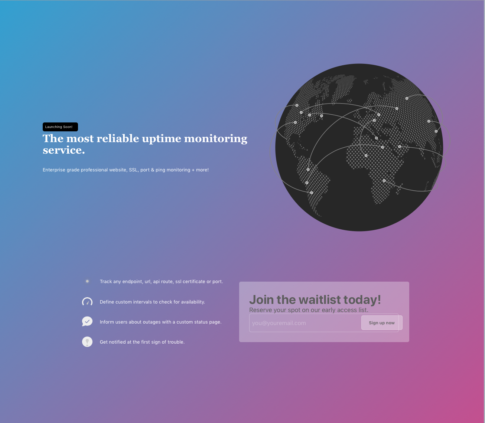

> In this article, we'll be building out a new page route `/landing` which will render the data from our landing page. 


Once you're sure the project is running and you're able to load the application let's take a moment to familiarize yourself with this starter template.

```shell
.
├── README.md
├── components
│   ├── Containers.js
│   ├── Link.js
│   ├── MarkdownJsx.js
│   ├── SEO.js
│   ├── landing
│   │   ├── BenefitsCards.js
│   │   ├── BrandList.js
│   │   ├── Card.js
│   │   ├── FeaturedBenefit.js
│   │   ├── FooterCta.js
│   │   ├── Header.js
│   │   ├── Hero.js
│   │   ├── Pricing.js
│   │   ├── RiskCta.js
│   │   ├── SectionHeading.js
│   │   ├── Testimonial.js
│   │   └── index.js
│   └── splash
│       ├── Cta.js
│       ├── Hero.js
│       ├── List.js
│       └── index.js
├── lib
├── next.config.js
├── package.json
├── pages
│   ├── _app.js
│   ├── api
│   │   └── hello.js
│   ├── index.js
├── public
│   ├── check.png
│   ├── favicon.ico
│   ├── logo-holder.svg
│   └── vercel.svg
├── styles
│   ├── Containers.module.css
│   ├── Home.module.css
│   ├── Landing.module.css
│   ├── Markdown.module.css
│   ├── globals.css
│   ├── landing
│   │   ├── BrandList.module.css
│   │   ├── Card.module.css
│   │   ├── FeaturedBenefits.module.css
│   │   ├── FooterCta.module.css
│   │   ├── Header.module.css
│   │   ├── Hero.module.css
│   │   ├── Pricing.module.css
│   │   ├── RiskCta.module.css
│   │   ├── SectionHeading.module.css
│   │   └── Testimonial.module.css
│   ├── normalize.css
│   └── splash
│       ├── Cta.module.css
│       ├── Hero.module.css
│       └── List.module.css
├── utils
│   └── data-helpers.js
└── yarn.lock
```

> Just like in the [previous articles](https://gsdev.hashnode.dev/series/airtable-cms), you'll find that the starter also includes all of the styles and each of the components you'll need for this project including a few helper functions that will make handling the data a bit simpler.


### Environment Variables

The next thing you'll need to do is add your environment variables used to connect to your **SyncInc** **Postgres** instance. You should already have a `.env.sample` file at the root of your project, simply rename this to `.env.local`, and fill in the values from your **SyncInc** dashboard.

```shell
# .env.local

DB_USER=
DB_HOST=
DB_NAME=
DB_PW=
DB_PORT=
```


1.  From your `SyncInc` dashboard click the "**Connect**" button.

   

2. You'll need to fill in the corresponding values from the credentials tab of the `SyncInc` dashboard

   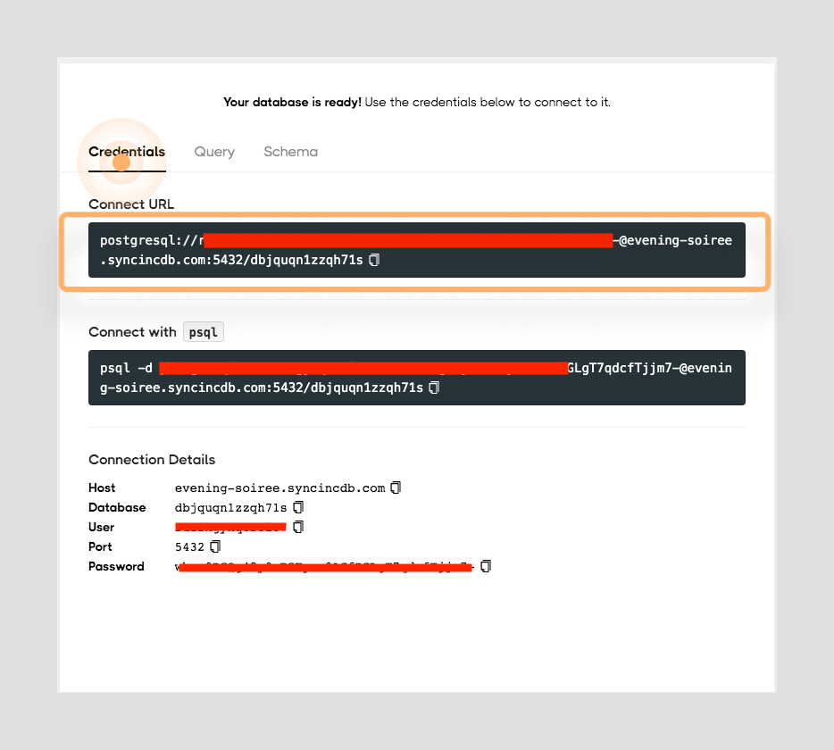


### Connect to your Sync Inc Database

The next logical step for us to is to take a look at how we're fetching data from Airtable using **SyncInc's** **Postgres** instance. 

In this article, we've taken a bit of a different approach where in the last article we used a single **Postgres** client instance, we're now implementing a pool of clients, which is the preferred method for allowing multiple database connections each with their own client instance and allows our connection to scale according to our needs. Let's take a look at how this works in your `/lib/pg-pool.js` file:

```js
// /lib/pg-pool.js

const { Pool } = require("pg");
// @link: https://node-postgres.com/guides/project-structure
// @link: https://node-postgres.com/guides/async-express

const pool = new Pool({
  // configure database (* optional)
  host: process.env.DB_HOST,
  port: process.env.DB_PORT,
  user: process.env.DB_USER,
  password: process.env.DB_PW,
  database: process.env.DB_NAME,
});

// retains count for number of connections established
let count = 0;

// used to log each pool connection
pool.on("connect", (client) => {
  client.count = count++;
  console.log(`clients connected: ${count}`);
});

// export an async query, which takes in necc. args.
module.exports = {
  // query from pooled connection
  async query(text, params) {
    const start = Date.now(); // get starting time
    // connect to pool
    const client = await pool.connect();
    const res = await client.query(text, params);
    client.release();
    const duration = Date.now() - start; // get elapsed time

    // log results
    console.log("executed query", {
      /* text, params, */
      duration,
      rows: res.rowCount,
    });
    return res; // return results
  },
};

```

> This has already been implemented for you in order to ensure that the splash page we built in the last project still remains functional. 


There's quite a bit going on here, but I think the comments provide a good amount of context. In either case, let's talk about how this differs from our initial approach.

#### PG Pool vs PG Client

Originally we used a Postgres `client` directly to query for our data and that works well for a single query. But for our use case, we'll need to make a separate query for each static page we want to generate at build-time in our application. The `client` will normally throw an error because essentially we're trying to re-use the same client for different queries.

> For more information see: [When to use a Pool vs a Client](https://stackoverflow.com/questions/56352974/what-is-the-difference-between-pool-query-and-client-query-with-the-node-pg-libr)

Now with our new approach, we first initialize a **pool** and then derive the **client** from that **pool**, so each time get a new **client** for each query, which means we can run several queries in parallel if we need to. 

```js
// configures postgres pool
const pool = new Pool({
  // configure database (* optional)
  host: process.env.DB_HOST,
  port: process.env.DB_PORT,
  user: process.env.DB_USER,
  password: process.env.DB_PW,
  database: process.env.DB_NAME,
});
```


Using the **pool** we're also able to provide better logging, currently we've set up an event listener that fires on each new **client** connection and logs the details for that connection. 

```js
// used to log each pool connection on each `connect` event
pool.on("connect", (client) => {
  client.count = count++;
  console.log(`clients connected: ${count}`);
});
```


And finally we export an async `query` function which we use as a wrapper to connect to a new **client** from our **pool**.

```js
// export an async query, which takes in necc. args.
module.exports = {
  // query from pooled connection
  async query(text, params) {
    const start = Date.now(); // get starting time
    // connect to pool and derive client
    const client = await pool.connect();
    const res = await client.query(text, params);
    client.release();
    const duration = Date.now() - start; // get elapsed time

    // log results
    console.log("executed query", {
      /* text, params, */
      duration,
      rows: res.rowCount,
    });
    return res; // return results
  },
};
```

> This function also takes in two arguments, `text` and `params`. The `text` is the actual raw **SQL** query statement while the `params` are any optional arguments that our query uses as variables to find and filter through our **Postgres** data.  


#### Querying

You'll notice that we're still able to use the exact same query, to get our data for our splash page.

```js
// lib/queries.js

export const SECTIONS_QUERY = `SELECT
      p.id AS page_id,
      p.title AS page_title,
      p.path AS page_path,
      p.order_ AS page_order,
      p.sectionid As page_sections_id,
      p.seoid AS page_seo_id,
      s.id AS section_id,
      s.title AS section_title,
      s.order_ AS section_order,
      s.type AS section_type,
      s.filter AS section_filter,
      s.blockid AS section_block_id,
      s.pageid AS section_page_id,
      b.id AS block_id,
      b.title AS block_title,
      b.lead AS block_lead,
      b.excerpt AS block_excerpt,
      b.content AS block_content,
      b.mediaid AS block_media_id,
      b.sectionid AS block_section_id,
      m.id AS media_id,
      m.title AS media_title,
      m.url AS media_url,
      m.alt AS media_alt,
      m.blockid AS media_block_id,
      m.seoid AS media_seo_id,
      seo.id AS seo_id,
      seo.title AS seo_title,
      seo.description AS seo_description,
      seo.keywords AS seo_keywords,
      seo.sitename AS seo_sitename,
      seo.url AS seo_url,
      seo.mediaid AS seo_media_id,
      seo.pageid AS seo_page_id
    FROM
      pages AS p 
      LEFT JOIN seo ON seo.id = ANY (p.seoid)
      LEFT JOIN sections AS s ON s.id = ANY (p.sectionid)
      LEFT JOIN blocks AS b ON b.id = ANY (s.blockid)
      LEFT JOIN media AS m ON m.id = ANY (b.mediaid)
    WHERE
      p.title IN ('launch')
    ORDER BY p.id ASC, s.order_ ASC`;
```


The one major difference is that now we're using our **Pool** connection rather than the **Client** to execute our query. 

```js
// lib/pg.js

const db = require("./pg-pool");

const { SECTIONS_QUERY } = require("./queries");

async function getSections() {
  // used for the Splash Page =>  airtable data
  try {
    // query database for sections and all related data.
    const res = await db.query(SECTIONS_QUERY);

    // handle success
    return res;
  } catch (err) {
    // handle errors
    console.error(err);
  }
}

module.exports = {
  getSections,
};
```

Now that we understand how our pooled connections are helping us manage our **SQL** queries, we can turn our attention to building out the **SQL** query we'll need to get the data for our landing page. 

Let's open up our database management tool. 

> ☝️ If you've been following along you'll recall we did the same thing in the [last article](https://gsdev.hashnode.dev/build-a-splash-page-with-syncinc-and-nextjs-using-airtable-as-a-cms) using [Table Plus](https://tableplus.com), but you can use any database management tool that supports Postgres and can execute queries. 

> ⚠️ If you need instructions on the setup again, you can also refer to **SyncInc's** guide: **[Connecting to your Postgres database](https://docs.syncinc.so/airtable/setup#connect-to-your-postgres-database)**.

You can use your database management tool to build out and test our new query against your actual database. 

Once you've set up the connection to your new **Postgres** database, go ahead and copy the query below and paste it into a new query file as shown in the screenshot below, and be sure to "**save**".

```sql
SELECT
	p.id AS page_id,
	p.title AS page_title,
	p.sectionid AS page_sections_id,
	p.seoid AS pages_seo_id,
	s.id AS section_id,
	s.title AS section_title,
	s.order_ AS section_order,
	s.type AS section_type,
	s.filter AS section_filter,
	s.blockid AS section_block_id,
	b.id AS block_id,
	b.order_ AS block_order,
	b.title AS block_title,
	b.lead AS block_lead,
	b.excerpt AS block_excerpt,
	b.content AS block_content,
	b.bullets AS block_bullets,
	b.mediaid AS block_media_id,
	b.linkid AS block_link_id,
	m.id AS media_id,
	m.title AS media_title,
	m.url AS media_url,
	m.alt AS media_alt,
	m.blockid AS media_block_id,
	m.seoid AS media_seo_id,
	links.id AS link_id,
	links.title AS link_title,
	links.description AS link_description,
	links.href AS link_href,
	links.type AS link_type,
	links.is_external AS link_is_externla,
	links.blockid AS link_block_id,
	seo.id AS seo_id,
	seo.title AS seo_title,
	seo.description AS seo_description,
	seo.keywords AS seo_keywords,
	seo.sitename AS seo_sitename,
	seo.url AS seo_url,
	seo.mediaid AS seo_media_id
FROM
	pages AS p
	LEFT JOIN seo ON seo.id = ANY (p.seoid)
	LEFT JOIN sections AS s ON s.id = ANY (p.sectionid)
	LEFT JOIN blocks AS b ON b.id = ANY (s.blockid)
	LEFT JOIN media AS m ON m.id = ANY (b.mediaid)
	LEFT JOIN links ON links.id = ANY (b.linkid)
WHERE
	p.title IN('landing')
ORDER BY
	s.order_ ASC;
```


1. Once you've saved your query click on the file you just created in the sidebar to load your query into the editor then click the **Run current** button (as shown below) to execute your query.

   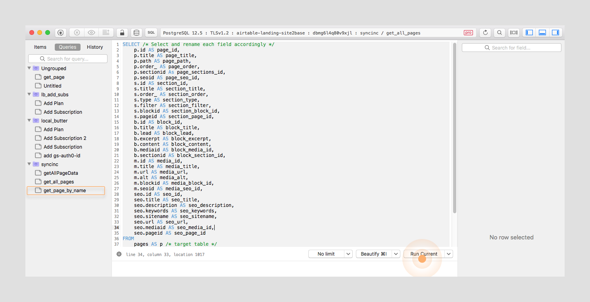

2. You should now see your query has been executed, and at the bottom of the window, it shows that the database returned 27 rows of data.

   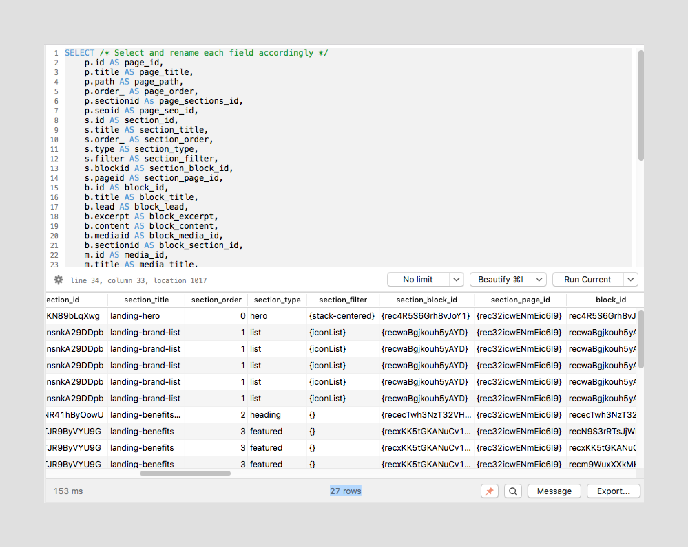 


If you look closely at this new query below, you'll notice that we're using an argument at the end inside of the `WHERE` clause to help target the specific page we want the data for. 

Up until now we only had data for one page, so we didn't have to make that distinction, but now that we have data for multiple pages, it makes sense to only fetch the data we need for each page specifically.

We'll also want to be able to re-use this query for any page, so we'll take a look at how we can provide the value for each page as an argument using a wrapper function to handle the query for us.

Now that we've tested our query and we know how it works, let's implement it in our application:

```js
// lib/queries.js

export const GET_PAGE_QUERY = `SELECT
	p.id AS page_id,
	p.title AS page_title,
	p.sectionid AS page_sections_id,
	p.seoid AS pages_seo_id,
	s.id AS section_id,
	s.title AS section_title,
	s.order_ AS section_order,
	s.type AS section_type,
	s.filter AS section_filter,
	s.blockid AS section_block_id,
	b.id AS block_id,
	b.order_ AS block_order,
	b.title AS block_title,
	b.lead AS block_lead,
	b.excerpt AS block_excerpt,
	b.content AS block_content,
  b.bullets AS block_bullets,
	b.mediaid AS block_media_id,
	b.linkid AS block_link_id,
	m.id AS media_id,
	m.title AS media_title,
	m.url AS media_url,
	m.alt AS media_alt,
	m.blockid As media_block_id,
	m.seoid AS media_seo_id,
	links.id AS link_id,
	links.title AS link_title,
	links.description AS link_description,
	links.href AS link_href,
	links.type AS link_type,
	links.is_external AS link_is_externla,
	links.blockid AS link_block_id,
	seo.id AS seo_id,
	seo.title AS seo_title,
	seo.description AS seo_description,
	seo.keywords AS seo_keywords,
	seo.sitename AS seo_sitename,
	seo.url AS seo_url,
	seo.mediaid AS seo_media_id
FROM
	pages AS p
	LEFT JOIN seo ON seo.id = ANY (p.seoid)
	LEFT JOIN sections AS s ON s.id = ANY (p.sectionid)
	LEFT JOIN blocks AS b ON b.id = ANY (s.blockid)
	LEFT JOIN media AS m ON m.id = ANY (b.mediaid)
	LEFT JOIN links ON links.id = ANY (b.linkid)
WHERE
	p.title IN($1)
ORDER BY s.order_ ASC`;
```

> Once again, if you look closely you'll notice that we're no longer hard-coding in our page name like we did when testing our query in **Table Plus**. Instead, we've created a **SQL** variable with the `$1` syntax inside of the `WHERE` clause. This allows us to populate this query with the title of the page that we need data for.  
>
> And since we expect the same data shape for each page we can easily make this query reusable.


Now we can supply our variable to the query from a custom wrapper function:

```js
// lib/pg.js

const { GET_PAGE_QUERY } = require("./queries");

/*  content truncated for brevity  */

// get all page data for a single page and returns Airtable data
async function getPage(page = "landing") {
  // defaults to landing page, 
  try {
    // query database uwing query argument: page
    // lists all records related to a specific page
    return db.query(GET_PAGE_QUERY, [page]);

    // handle success
  } catch (err) {
    console.error(err);
  }
}

// be sure to export the getPage function:
module.exports = {
  getSections,
  getPage,
};
```

> **NOTE:** Although the current `GET_PAGE_QUERY` only declares a single variable, we can actually define as many as we need for our queries. 
>
> As you can see from the following:
>
> ```js
> return db.query(GET_PAGE_QUERY, [page]); // 2nd arg: [params]
> ```
>
> The 2nd argument to the query method takes an array of params, used to populate the values for the variables in our query. In our case, this is the `title` of the page we are querying for. 
>
> Currently, we only have that single variable declared within our query so we only need to populate the array with a single param, but you could just as easily declare multiple variables and then include multiple params in the array when necessary. 
>
> Each of the params maps to a variable by its position in the array. So the first param maps to `$1` and the next would map to `$2` and so on for as many variables you need to declare. 


With our query wrapper function in place, we can now use it to get the data we need to render our landing page.


### Static Site Generation

As we saw in the previous articles, we can use the built-in data-fetching methods provided by Next.js to grab any data we need at build time to help render our static pages.

Although there are many useful ways to fetch and handle data in a Next.js application, we've been using the `getStaticProps()` function to asynchronously grab our data while our page is being built.

We're going to do the same thing here. We'll be using the wrapper function we created `getPage()` to query our cloud Postgres instance for the data we need.


> 🕥  **RECALL: ** Next.js automatically executes any logic defined in `getStaticProps()` function from any Page Component file at build-time. 


#### Jump Ahead😎

>  If you're confident with Next.js and what you've learned so far, I urge you to give the following a try on your own. 
>
> ---
>
> 1. Create a new file `pages/landing.js` for your landing page.
>
> 2. Create and export a default *Page Component* from the `/landing.js` page file.
>
>    >  Navigate to your page in the browser (http://localhost:3000/landing) and make sure you don't have any 404 errors.
>
> 3. Now export an asynchronous `getStaticProps()` function and asynchronously import your `getPage()` function inside of it.
>
> 4. Execute the `getPage()` function and only return the `rows` array from the response as props from `getStaticProps()`.
>
> 5. Handle the props you returned from `getStaticProps()` in your *Page Component* and use `JSON.stringify(props.rows)` to dump the data out onto the page. 


#### ⚠️ Spoiler Warning

Ok let's go through it together:


First, let's create a new file in the pages directory where you can define your Landing *Page Component*. 

```jsx
// pages/landing.js

export default function Landing({ page }) {
  return page && <div>{JSON.stringify(page)}</div>;
}
```

> ☝️ Remember to make sure that the *Page Component* is the default export from this file. 


Next, let's define our asynchronous `getStaticProps()` function. 

```jsx
// pages/landing.js

export default function Landing({ page }) {
  return page && <div>{JSON.stringify(page)}</div>;
}

export async function getStaticProps() {

  return {
    props: {
      page: [];
    },
  };
}
```


Now we can implement our data fetching logic inside of the `getStaticProps()` function.

```jsx
// pages/landing.js

export default function Landing({ page }) {
  return page && <div>{JSON.stringify(page)}</div>;
}

export async function getStaticProps() {
  const { getPage } = await import("../lib/pg");

  const response = await getPage("landing");
  return {
    props: {
      page: response.rows;
    },
  };
}
```


If you were successful in fetching the data and dumping it onto the page,  then your results should be similar to what you see in the screenshot below:

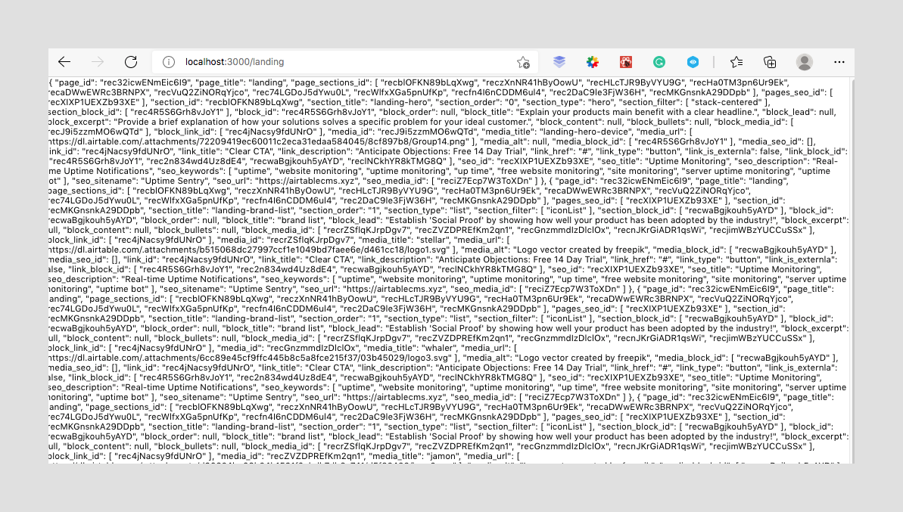


Before we go any further let's examine the data we get back from querying our **Postgres** database in our console.

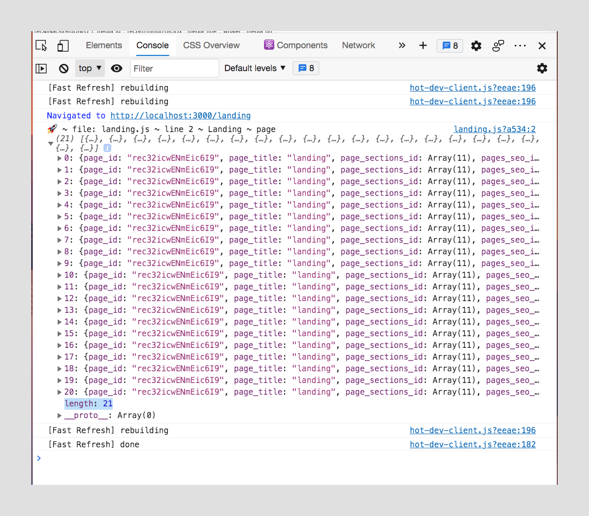


We seem to get back exactly 21 rows of data. If we dig a bit further we see that the shape of our data is flat, we haven't maintained any sort of hierarchy in our data. Which is expected, but is still something we'll want to address.

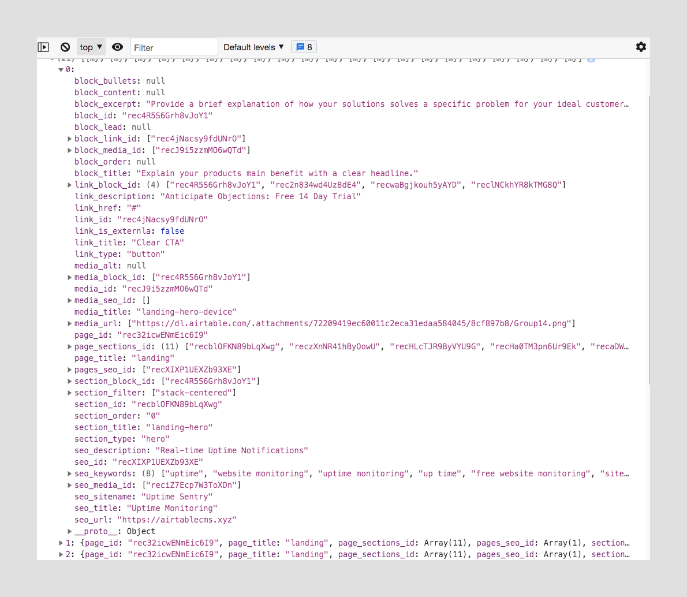


In the [last article](https://gsdev.hashnode.dev/build-a-splash-page-with-syncinc-and-nextjs-using-airtable-as-a-cms), we used a factory function to transform our data, and we'll do the same here. Although this time it is a bit different in that, we'll be using several factory functions together.

We'll pass our page data through the `PageBuild()` function before we return it from `getStaticProps()` as props.

Let's take a look at the `PageBuild()` function to see what it does for us - open up the file `utils/data-helpers.js`:

```js
// utils/data-helpers.js

export function PageBuild(rows) {
  // transforms page data
  const seo = new Seo(rows[0]);
  return {
    seo,
    page: rows?.length && rows?.map((row) => new Row(row)),
  };
}
```

> From the code block  above, it's clear that most of the logic that actually handles the transforms is defined within the `Seo()` factory function, and the logic that transforms the page rows is likely defined in the `Row()` factory function.
>
> ⚠️  Both of these factory functions are located in the same file, feel free to browse through them so that you understand how the data is being transformed, it's quite straight forward so we're going to skip over displaying them here. But here's how they're implemented in our `PageBuild()` function...
>
> First, we grab the first item of the rows array and simply pluck out the SEO-related metadata for this page using the Seo() factory function.
>
> Next, we iterate over each item in the rows array and return a new row in the exact shape that we expect our data to be in using the `Row()` factory function.
>
> We then return both the `seo` object and `page` array back.


Now let's take a look at how we implement this inside of the `getStaticProps()` function:

```js
// pages/landing.js

import { PageBuild } from "../utils/data-helpers";

export default function Landing({ page }) {
  return <div>{JSON.stringify(page)}</div>;
}

export async function getStaticProps() {
  const { getPage } = await import("../lib/pg");

  const response = await getPage("landing");
  const page = PageBuild(response?.rows);

  return {
    props: {
      page,
    },
  };
}
```

With this in place, all the hard work is done, we've successfully set up our `getStaticProps()` function and implemented all of the data-fetching logic we'll need. 

Now we can work to simply render each of these items from the `page` array.


### UI/UX

As with the previous articles in [this series](https://gsdev.hashnode.dev/series/airtable-cms), you already have all of the components and styles you need to render the data pre-fabricated for you in the components in the `components/landing` directory. 

```shell
.
├── components
│   ├── Containers.js
│   ├── Link.js
│   ├── MarkdownJsx.js
│   ├── SEO.js
│   ├── landing
│   │   ├── BenefitsCards.js
│   │   ├── BrandList.js
│   │   ├── Card.js
│   │   ├── FeaturedBenefit.js
│   │   ├── FooterCta.js
│   │   ├── Header.js
│   │   ├── Hero.js
│   │   ├── Pricing.js
│   │   ├── RiskCta.js
│   │   ├── SectionHeading.js
│   │   ├── Testimonial.js
│   │   └── index.js
```

All you have to do is structure the page accordingly and use these components to render the appropriate section of the page. 


> 👀  **NOTE:** If you haven't done so already be sure to take a look at the [Project Demo](https://tinyurl.com/post3-final-preview) so you have a better idea of what you're building.


#### SEO

Let's start at the beginning, with our `SEO` component. Unlike the previous articles, this time around we'll be using a custom `SEO` component that has already been created for you, but let's take a look at the component itself, and see what it does for us.

```jsx
// components/SEO.js

import Head from "next/head";

export const SEO = ({ seo }) => {
  return (
    <Head>
      <title>{seo.title}</title>
      <meta name='viewport' content='initial-scale=1.0, width=device-width' />
      <meta name='description' content={seo.description} />
      <meta property='og:title' content={seo.title} />
      <meta property='og:site_name' content={seo.sitename} />
      <meta property='og:url' content={seo.url} />
      <meta property='og:description' content={seo.description} />
      <meta property='og:image' content={seo.url} />
      <link rel='icon' href='/favicon.ico' />
      <link rel='cannonical' href={seo.url} />
    </Head>
  );
};
```

> The SEO component takes in a single prop - - a `seo` object, and we then use it to populate all of the metadata for our page.


Implementing the `SEO` component is pretty straightforward thanks to our factory functions that shaped our data for us.

```jsx
// pages/landing.js

import { SEO } from "../components/SEO";

export default function Landing({ page }) {
  const { seo, page: rows } = page;

  return (
    <>
      <SEO seo={seo} />
      <div>{JSON.stringify(page)}</div>;
    </>
  );
}
```

With this in place, you should see the title of your page has changed indicating that we've successfully implemented our SEO metadata for this page.

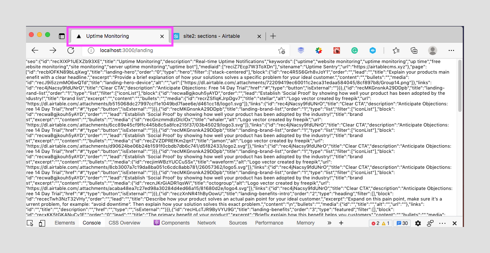


So far so great, let's move on and set up a bit of the boilerplate for the landing page.

```jsx
// pages/landing.js

import { Header } from "../components/landing";

import styles from "../styles/Landing.module.css";

export default function Landing({ page }) {
  const { seo, page: rows } = page;

  return (
    <>
      <SEO seo={seo} />
      <div className={styles.pageWrapper}>
        <Header brandName={seo?.title} />
        <main className={styles.main}>Test</main>
        <footer className={styles.footer}>
          {" "}
          &copy;
          <span>Uptime Sentry</span> {new Date().getFullYear()}
        </footer>
      </div>
    </>
  );
}

```

You should now be able to see your header and footer rendered out accordingly.


Now before we get back to rendering our data, we'll need to transform it one step further, by sorting our rows logically, by their titles. Rows with matching titles will get grouped together as a single row, this helps us flatten `sections` that use multiple `blocks` to render the appropriate data. 

First, let's take a look at the helper functions we'll use to apply our sorting logic:

```js
// utils/data-helpers.js

export function groupBy(arr, key) {
  // groups objests in array into grouped arrays based on matching key
  return arr.reduce(function (rv, x) {
    (rv[x[key]] = rv[x[key]] || []).push(x);

    return rv;
  }, {});
}

export function sortRows(rows) {
  // used to group and camelCase an array of airtable rows, by their matching titles
  const interim = groupBy(rows, "title");
  return Object.keys(interim)?.map((key) => {
    const newKey = camelize(key);
    return {
      [newKey]: interim[key],
    };
  });
}
```

`sortRows()` takes in all of our rows and iterates over them using the `groupBy()` function to group them by matching titles which results in a single object for each row with the `title` of each row used as the key. We then take that object, and transform the keys from the [kebab-cased](https://www.theserverside.com/definition/Kebab-case) titles to [camel-cased](https://en.wikipedia.org/wiki/Camel_case) property names and finally return an array of sorted rows.


```jsx
// pages/landing.js

import { PageBuild, sortRows } from "../utils/data-helpers";

export default function Landing({ page }) {
  const { seo, page: rows } = page;
  const sortedRows = sortRows(rows);
  console.log("🚀 ~ file: landing.js sortedRows", sortedRows)

  return (
    <>
			{/* truncated for brevity */}
    </>
  );
}
```

Now let's take a look at the sorted data in your console:

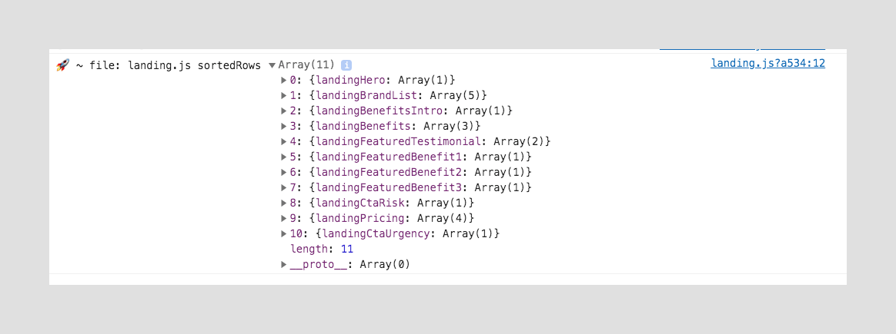


Now that we have our data properly sorted, let's turn our focus back to rendering it out, starting with the `Hero` component, where we'll just de-structure the data we need right from the `sortedRows` array.

```jsx
import { Container, Section, Row } from "../components/Containers";
import { Header, Hero } from "../components/landing";

export default function Landing({ page }) {
  const { seo, page: rows } = page;

  // pluck the hero component's data out of the array.
  const [{landingHero}] = sortRows(rows); 
  
  return (
    <>
      <SEO seo={seo} />
      <div className={styles.pageWrapper}>
        <Header brandName={seo?.title} />
      
     		<Section style={{ padding: "2em", textAlign: "center" }}>
          <Hero block={landingHero[0]?.block} />
        </Section>
      
        <footer className={styles.footer}>
          {" "}
          &copy;
          <span>Uptime Sentry</span> {new Date().getFullYear()}
        </footer>
      </div>
    </>
  );
}
```

> We simply pass in the `block` related to the `Hero` component as props, the component will handle the rest. 
>
> 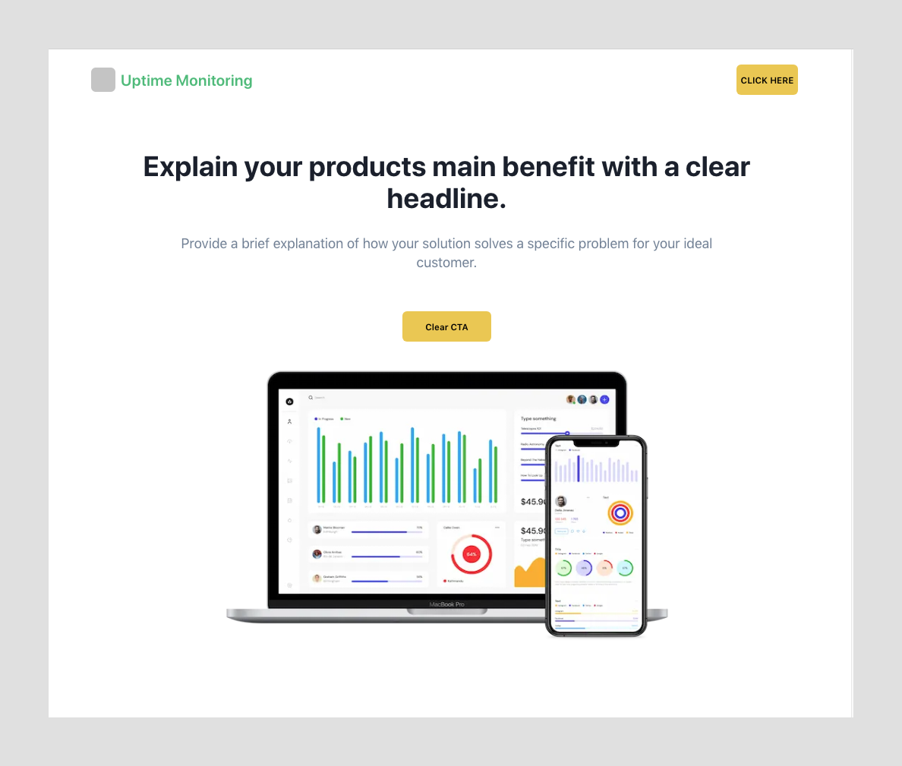
>
> 👀 If you're curious as to what the `Hero` component is doing, feel free to take a look at the file: `components/landing/Hero.js`, but once again since it's pretty straightforward, we're not going to go over it in detail here. 


The next component we'll want to render is the `BrandList` component that we use as social proof.

```jsx
// pages/landing.js

import { BrandList, Header, Hero } from "../components/landing";


export default function Landing({ page }) {
  const { seo, page: rows } = page;
  const [{ landingHero }, { landingBrandList }] = sortRows(rows);

  return (
    <>
      <SEO seo={seo} />
      <div className={styles.pageWrapper}>
        <Header brandName={seo?.title} />
        <main className={styles.main}>
          <Section style={{ padding: "2em", textAlign: "center" }}>
            <Hero block={landingHero[0]?.block} />
            
            <Container>
              <BrandList data={landingBrandList} />
            </Container>
          
          </Section>
        </main>
        <footer className={styles.footer}>
          &copy;
          <span>Uptime Sentry</span> {new Date().getFullYear()}
        </footer>
      </div>
    </>
  );
}
```

> Once again this is a simple component, but you can dig further: `components/landing/BrandList.js`
>
>  


The next component actually renders two of our sections at once:

```jsx
// pages/landing.js

import { BenefitsCards, BrandList, Header, Hero } from "../components/landing";

export default function Landing({ page }) {
  const { seo, page: rows } = page;
  
  const [
    { landingHero },
    { landingBrandList },
    { landingBenefitsIntro },
    { landingBenefits },
  ] = sortRows(rows);
  
  return (
    <>
      <SEO seo={seo} />
      <div className={styles.pageWrapper}>
        <Header brandName={seo?.title} />
        <main className={styles.main}>
  				{/* truncated for brevity */}
          
          <Section className='secondary-light'>
            <BenefitsCards
              headingBlock={landingBenefitsIntro[0].block}
              // sort by block order ASC
              data={landingBenefits.sort((a, b) =>
                a.block.order > b.block.order ? 1 : -1
              )}
            />
	        </Section>
          
        </main>
      
      	{/* truncated for brevity */}
      </div>
    </>
  );
}

```

> The `BenefitsCards` components render both the `landingBenefitsIntro ` and `landingBenefits` sections. 
> ☝️You might've noticed that we sort the data according to the `block.order` field before we pass it in as props. 


We'll also include the `featuredTestimonial` in this same section, but first, we de-structure it off of the `landingFeaturedTestimonial` array.

```jsx
// pages/landing.js

import {
  BenefitsCards,
  BrandList,
  Header,
  Hero,
  Testimonial,
} from "../components/landing";

export default function Landing({ page }) {
  const { seo, page: rows } = page;
  
  const [
    { landingHero },
    { landingBrandList },
    { landingBenefitsIntro },
    { landingBenefits },
    { landingFeaturedTestimonial },
  ] = sortRows(rows);

  // we'll be using this in multiple places, so we'll store it for easy access.
  const [featuredTestimonial] = landingFeaturedTestimonial;
  
  return (
    <>
      <SEO seo={seo} />
      <div className={styles.pageWrapper}>
        <Header brandName={seo?.title} />
        <main className={styles.main}>
  				{/* truncated for brevity */}
          
          <Section className='secondary-light'>
            <BenefitsCards
              headingBlock={landingBenefitsIntro[0].block}
              data={landingBenefits.sort((a, b) =>
                a.block.order > b.block.order ? 1 : -1
              )}
            />
            
            <Testimonial block={featuredTestimonial.block} />
            
	        </Section>
          
        </main>
      
      	{/* truncated for brevity */}
      </div>
    </>
  );
}
```

> 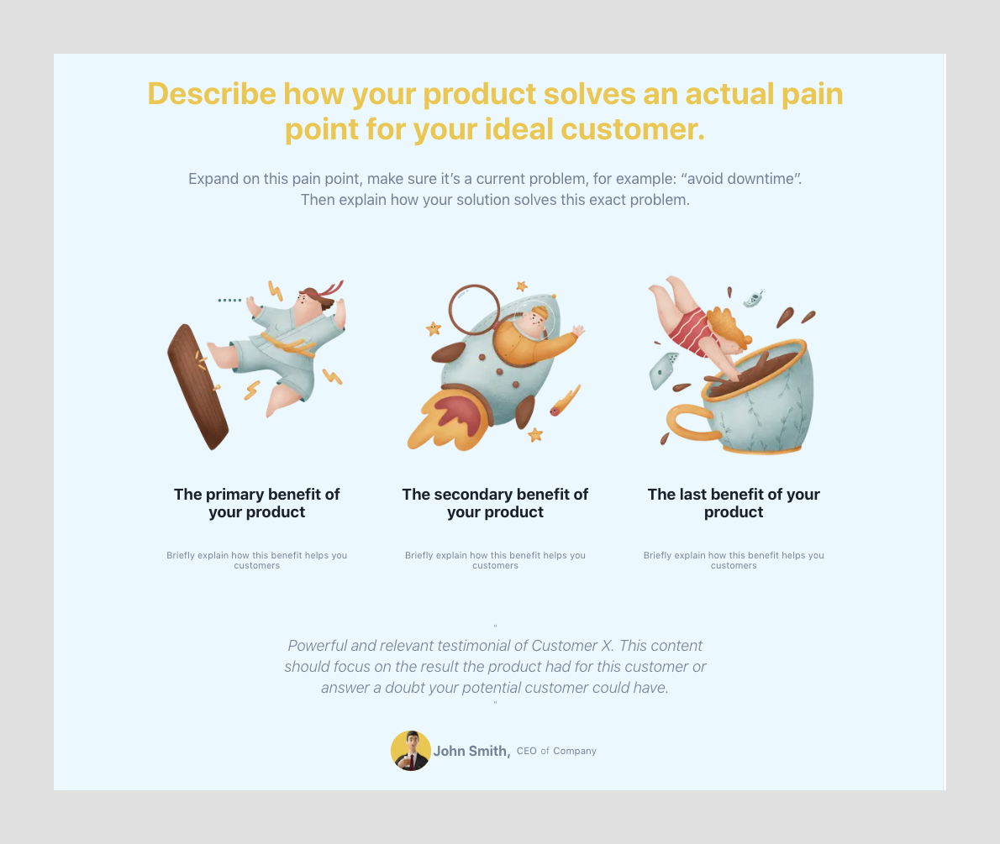


Next up we have 3 `FeaturedBenefit` blocks in total that we'll render accordingly: 

```jsx
// pages/landing.js

import {
  BenefitsCards,
  BrandList,
  FeaturedBenefit,
  Header,
  Hero,
  Testimonial,
} from "../components/landing";

export default function Landing({ page }) {
  const { seo, page: rows } = page;
  
  const [
    { landingHero },
    { landingBrandList },
    { landingBenefitsIntro },
    { landingBenefits },
    { landingFeaturedTestimonial },
    { landingFeaturedBenefit1 },
    { landingFeaturedBenefit2 },
    { landingFeaturedBenefit3 },
  ] = sortRows(rows);

  // we'll be using this in multiple places, so we'll store it for easy access.
  const [featuredTestimonial] = landingFeaturedTestimonial;
  
  return (
    <>
      <SEO seo={seo} />
      <div className={styles.pageWrapper}>
        <Header brandName={seo?.title} />
        <main className={styles.main}>
  				{/* truncated for brevity */}
          
          <Section>
            <Container>
              <FeaturedBenefit
                block={landingFeaturedBenefit1[0].block}
                alternate={landingFeaturedBenefit1[0]["filter"].includes(
                  "reverse"
                )}
              />
            </Container>
            <div style={{ width: "100%", background: "var(--primary-light)" }}>
              <Container>
                <FeaturedBenefit
                  block={landingFeaturedBenefit2[0].block}
                  alternate={landingFeaturedBenefit2[0]["filter"].includes(
                    "reverse"
                  )}
                />
              </Container>
            </div>
            <Container>
              <FeaturedBenefit
                block={landingFeaturedBenefit3[0].block}
                alternate={landingFeaturedBenefit3[0]["filter"].includes(
                  "reverse"
                )}
              />
            </Container>
          </Section>
          
        </main>
      
      	{/* truncated for brevity */}
      </div>
    </>
  );
}
```

> Each of the `FeaturedBenefit` components takes in the block it will render as a prop. As well as an `alternate` prop that is used to determine which item's layout will get flipped in our UI. 
>
> We use the `sections.filter` field to designate the `block` that will get rendered with an alternate layout.
>
> 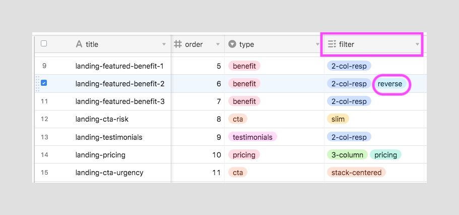
>
> 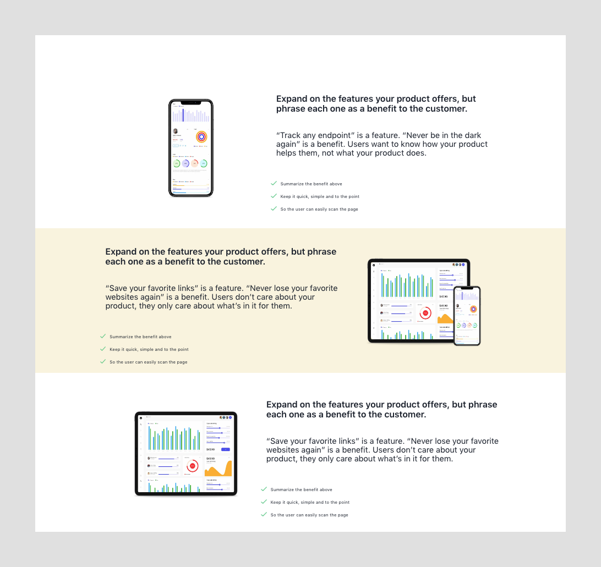


#### Rendering Markdown

Let's take a moment to discuss how this component is being rendered. Particularly how we're rendering the `rich text` for the `bullets` field. 

We discussed how the `rich text` fields are delivered to us as a **markdown** string. Now let's take a look at how we can render that markdown content. 

```jsx
// components/landing/FeaturedBenefit.js

import Image from "next/image";

import { Row } from "../Containers";
import { MarkdownJSX } from "../MarkdownJsx";

import styles from "../../styles/landing/FeaturedBenefits.module.css";

export const FeaturedBenefit = ({ block, alternate, data }) => {
  return (
    <>
      <Row
        className={[styles?.benefit, alternate ? styles?.alternate : ""].join(
          " "
        )}
        data-test={data}
      >
        <Image
          src={block?.media?.url[0]}
          alt={block.media?.alt}
          layout='intrinsic'
          width={1180}
          height={920}
        />

        <div className={styles.content}>
          <h3>{block.title}</h3>
          <p>{block.excerpt}</p>
          <MarkdownJSX
            className={styles.markdown}
            markdown={block.bullets}
            overrides={{
              ul: (props) => <ul className={styles.ul} {...props} />,
              li: (props) => <li className={styles.li} {...props} />,
            }}
          />
        </div>
      </Row>
    </>
  );
};
```

> For the most part, this component is like any other, but you might not be familiar with our approach to rendering our bulleted lists from markdown content.


We use a custom component called `MarkdownJSX` which is essentially a wrapper around the third-party library: [markdown-to-jsx](https://github.com/probablyup/markdown-to-jsx). 

```jsx
// components/MarkdownJsx.js

import Markdown from "markdown-to-jsx";
import styles from "../styles/Markdown.module.css";
export const MarkdownJSX = ({
  markdown = "",
  type = "list",
  highlight = false,
  overrides,
  ...rest
}) => {
  return (
    <Markdown
      className={styles.markdown}
      {...rest}
      options={{
        overrides: {
          // overrides allow defining of specific components to be used to render each element
          span: (props) => (
            <span className={styles.span} {...props} {...rest.span} />
          ),
          ul: (props) => <ul className={styles.ul} {...props} {...rest.ul} />,
          li: (props) => (
            <li
              className={styles.li}
              style={highlight ? { ...highlightStyles } : {}}
              {...props}
              {...rest.li}
            />
          ),
        },
      }}
    >
      {markdown}
    </Markdown>
  );
};

const highlightStyles = {
  fontWeight: "bold",
  fontSize: "medium",
};

```

This component takes in a `markdown` prop that expects "stringified" markdown content. We then take that markdown content and render it as a child of the component.

The options object of our `Markdown` component is where all the magic happens. This is where we define custom components used as `overrides` to render each of the elements we expect to be passed in as markdown content.

Since we're only using markdown for the sole purpose of rendering out our unordered bulleted lists, we've only provided 3 custom components.

- `span` for situations where our content is wrapped in a span
- `ul` for the unordered list
- `li` for each of the list items.


With this logic, we're able to target and style each of the elements that get output from our markdown content and override those styles in-line when we need to.

Now that you have a good grasp of how we're using the [markdown-to-jsx](https://github.com/probablyup/markdown-to-jsx) package to help render our bulleted lists from the `rich-text` content we get back from Airtable, let's move on to rendering our last few sections of this page.


The next component we need to render is the `RiskCta`, the only caveat here is that we're still rendering it inside the same `section` element as the `FeaturedBenefit` components.

```jsx
// pages/landing.js

import {
  BenefitsCards,
  BrandList,
  FeaturedBenefit,
  Header,
  Hero,
  RiskCta,
  Testimonial,
} from "../components/landing";

export default function Landing({ page }) {
  const { seo, page: rows } = page;
  const [
    { landingHero },
    { landingBrandList },
    { landingBenefitsIntro },
    { landingBenefits },
    { landingFeaturedTestimonial },
    { landingFeaturedBenefit1 },
    { landingFeaturedBenefit2 },
    { landingFeaturedBenefit3 },
    { landingCtaRisk },
  ] = sortRows(rows);

  const [featuredTestimonial] = landingFeaturedTestimonial;
	
 return (
    <>
      <SEO seo={seo} />
      <div className={styles.pageWrapper}>
        <Header brandName={seo?.title} />
        <main className={styles.main}>
  				{/* truncated for brevity */}
          
          <Section>

            {/* truncated for brevity */}
            
            {/* 
            ☝️ the RiskCta component gets rendered in the same section as FeaturedBenefits 						 */}
            
            <div style={{ width: "100%", background: "var(--secondary-light)" }}>
            	<RiskCta block={landingCtaRisk[0].block} />
	          </div>
            
          </Section>
          
        </main>
      
      	{/* truncated for brevity */}
      </div>
    </>
  ); 
  
}
```

> 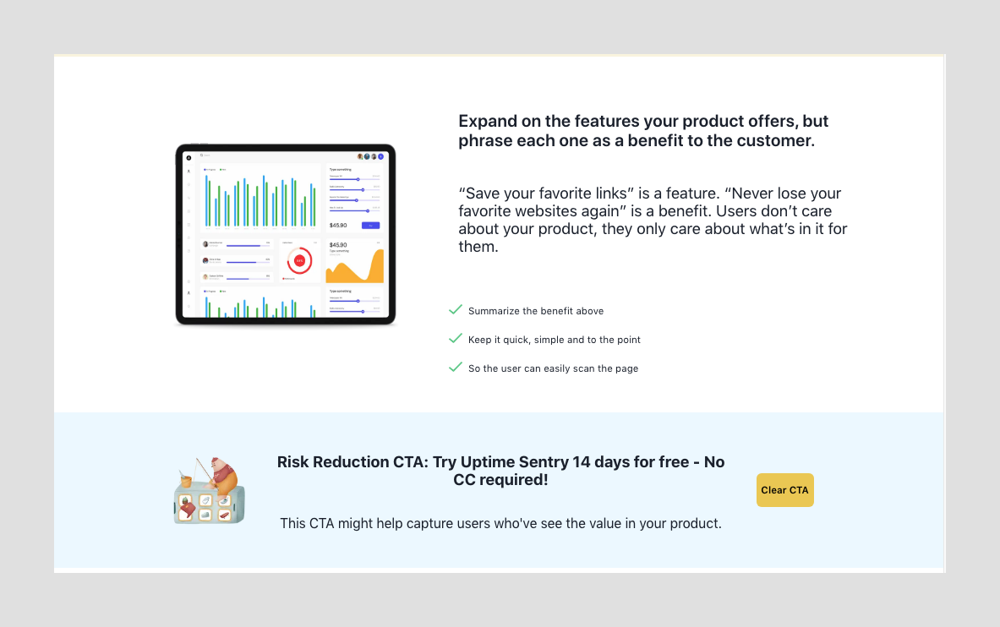


```jsx
// pages/landing.js

import {
  BenefitsCards,
  BrandList,
  FeaturedBenefit,
  Header,
  Hero,
  Pricing,
  RiskCta,
  Testimonial,
} from "../components/landing";

export default function Landing({ page }) {
  const { seo, page: rows } = page;
  const [
    { landingHero },
    { landingBrandList },
    { landingBenefitsIntro },
    { landingBenefits },
    { landingFeaturedTestimonial },
    { landingFeaturedBenefit1 },
    { landingFeaturedBenefit2 },
    { landingFeaturedBenefit3 },
    { landingCtaRisk },
    { landingPricing },
  ] = sortRows(rows);

  const [featuredTestimonial] = landingFeaturedTestimonial;
	
 return (
    <>
      <SEO seo={seo} />
      <div className={styles.pageWrapper}>
        <Header brandName={seo?.title} />
        <main className={styles.main}>
  				{/* truncated for brevity */}
          
            
            <Section>
              <Container>
                <Pricing data={landingPricing} />
              </Container>
            </Section>
            
        </main>
      
      	{/* truncated for brevity */}
      </div>
    </>
  ); 
  
}
```

> The `Pricing` component also renders a markdown list just like we did with the `FeaturedBenefit` Component. And we implement a bit of logic to emphasize the perferred pricing plan by styling it just a bit differently to make it stand out amongst the rest of the options. 


The final `Pricing` component is rendered using several smaller components which allows us to offload some of the rendering responsibility to components where it makes sense.

```jsx
// components/landing/Pricing.js

import { Link } from "../Link";
import { Container, Row } from "../Containers";
import { MarkdownJSX } from "../MarkdownJsx";

import styles from "../../styles/landing/Pricing.module.css";

export const PricesHeading = ({ block }) => {
  return (
    <Container className={styles.prices_heading}>
      <h2>{block.title}</h2>
      <p>{block.excerpt}</p>
    </Container>
  );
};


export const Pricing = ({ data, render = renderPricingCard }) => {
  
  // sort data by "block.order" so that we can ensure the first item is always the heading
  const [pricesHeading, ...restPricing] = data.sort((a, b) =>
    a.block.order > b.block.order ? 1 : -1
  );
  return (
    <>
      <PricesHeading block={pricesHeading.block} />
      <Container className={styles.prices}>
        <Row className='fluid'>
          {/*
          the restPricing array will always have 3 prices in it
          -- use sort to target the middle price as the featured price
          -- then immediately iterate over that sorted array and render each PricingCard
          */}
          {restPricing.sort((a, b) => (a.title > b.title ? -1 : 1)).map(render)}
        </Row>
      </Container>
    </>
  );
};

export const PricingCard = ({ pricing, isFeatured }) => {
  return (
    <>
      <div
        className={styles.price_card}
        style={{
          width: isFeatured ? "1200px" : "100%",
          border: isFeatured ? "2px solid var(--secondary)" : "none",
        }}
      >
        <div className={styles.pricepoint}>
          <p>{pricing.block.lead}</p>
          <h2>${pricing.block.title}</h2>
          <small>{pricing.block.excerpt}</small>
          <br />
          <p className={styles.excerpt}>{pricing.block.content}</p>
        </div>

        <MarkdownJSX
          markdown={pricing.block.bullets}
          type='pricing'
          highlight={isFeatured}
        />
        <div>
          <Link
            className={`button primary ${isFeatured ? "" : "outline"}`}
            href={pricing.block.links.href}
          >
            {pricing.block.links.title}
          </Link>
        </div>
      </div>
    </>
  );
};


function renderPricingCard(pricing, i) {
  return (
    <PricingCard
      key={`${pricing.id}-${i}`}
      pricing={pricing}
      // price at index: 1 is the featured price value.
      isFeatured={i === 1} // used to highlight the featured pricepoint
    />
  );
}
```

> Most of the logic here is handled by the `Pricing` component, where we sort the data accordingly by `block.order` and render the `PricesHeading` and each of the `PricingCard` components.
>
> ☝️You might've noticed that we sort our prices by `title` before we render each `PricingCard`. This is because we use the `title` field in our Airtable base to populate the actual price value. So essentially when we sort by `title` we're actually sorting by price point. 
>
> 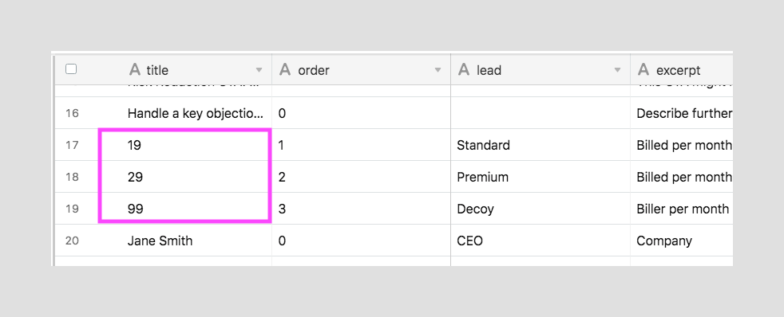
>
> 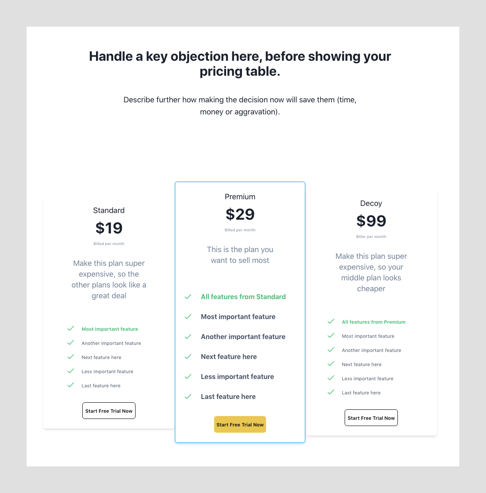


Time for the final component, this one is simple once again:

```jsx
// pages/landing.js

import {
  BenefitsCards,
  BrandList,
  FeaturedBenefit,
  FooterCta,
  Header,
  Hero,
  Pricing,
  RiskCta,
  Testimonial,
} from "../components/landing";

export default function Landing({ page }) {
  const { seo, page: rows } = page;
  const [
    { landingHero },
    { landingBrandList },
    { landingBenefitsIntro },
    { landingBenefits },
    { landingFeaturedTestimonial },
    { landingFeaturedBenefit1 },
    { landingFeaturedBenefit2 },
    { landingFeaturedBenefit3 },
    { landingCtaRisk },
    { landingPricing },
    { landingCtaUrgency },
  ] = sortRows(rows);

  const [featuredTestimonial] = landingFeaturedTestimonial;
	
 return (
    <>
      <SEO seo={seo} />
      <div className={styles.pageWrapper}>
        <Header brandName={seo?.title} />
        <main className={styles.main}>
  				{/* truncated for brevity */}
          
            <Section className='primary-lighter'>
              <Container style={{ margin: "4em auto" }}>
                <FooterCta block={landingCtaUrgency[0].block} />
              </Container>
            </Section>
            
        </main>
      
      	{/* truncated for brevity */}
      </div>
    </>
  ); 
  
}


```

> And that's it for the last component...
>
> 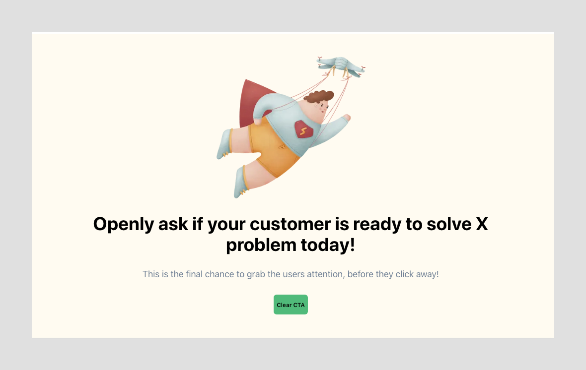


Lastly, here's the completed markup for the `pages/landing.js` file, take a look at this if you need to compare your work or get stuck.

```jsx
// pages/landing.js

import { SEO } from "../components/SEO";
import { Container, Section, Row } from "../components/Containers";
import {
  BrandList,
  BenefitsCards,
  FeaturedBenefit,
  Header,
  Hero,
  Pricing,
  RiskCta,
  Testimonial,
  FooterCta,
} from "../components/landing";

import { PageBuild, sortRows } from "../utils/data-helpers";
import styles from "../styles/Landing.module.css";

export default function Landing({ page = {} }) {
  const { seo, page: rows } = page;

  const [
    { landingHero },
    { landingBrandList },
    { landingBenefitsIntro },
    { landingBenefits },
    { landingFeaturedTestimonial },
    { landingFeaturedBenefit1 },
    { landingFeaturedBenefit2 },
    { landingFeaturedBenefit3 },
    { landingCtaRisk },
    { landingPricing },
    { landingCtaUrgency },
  ] = sortRows(rows);

  const [featuredTestimonial] = landingFeaturedTestimonial;

  return (
    <div className={styles.pageWrapper}>
      <SEO seo={seo} />
      <Header brandName={seo?.title} />
      <main className={styles.main}>
        <Section style={{ padding: "2em", textAlign: "center" }}>
          <Hero block={landingHero[0]?.block} />
          <Container>{<BrandList data={landingBrandList} />}</Container>
        </Section>
        <Section className='secondary-light'>
          <BenefitsCards
            headingBlock={landingBenefitsIntro[0].block}
            // sort by block order ASC
            data={landingBenefits.sort((a, b) =>
              a.block.order > b.block.order ? 1 : -1
            )}
          />
          <Testimonial block={featuredTestimonial.block} />
        </Section>
        <Section>
          <Container>
            <FeaturedBenefit
              block={landingFeaturedBenefit1[0].block}
              alternate={landingFeaturedBenefit1[0]["filter"].includes(
                "reverse"
              )}
            />
          </Container>
          <div style={{ width: "100%", background: "var(--primary-light)" }}>
            <Container>
              <FeaturedBenefit
                block={landingFeaturedBenefit2[0].block}
                alternate={landingFeaturedBenefit2[0]["filter"].includes(
                  "reverse"
                )}
              />
            </Container>
          </div>
          <Container>
            <FeaturedBenefit
              block={landingFeaturedBenefit3[0].block}
              alternate={landingFeaturedBenefit3[0]["filter"].includes(
                "reverse"
              )}
            />
          </Container>
          <div style={{ width: "100%", background: "var(--secondary-light)" }}>
            {/* <Container> */}
            <RiskCta block={landingCtaRisk[0].block} />
            {/* </Container> */}
          </div>
        </Section>
        <Section>
          <Container>
            <Pricing data={landingPricing} />
          </Container>
        </Section>
        <Section className='primary-lighter'>
          <Container style={{ margin: "4em auto" }}>
            <FooterCta block={landingCtaUrgency[0].block} />
          </Container>
        </Section>
      </main>
      <footer className={styles.footer}>
        {" "}
        &copy;
        <span>Uptime Sentry</span> {new Date().getFullYear()}
      </footer>
    </div>
  );
}

export async function getStaticProps() {
  const { getPage } = await import("../lib/pg");

  const response = await getPage("landing");
  const page = PageBuild(response?.rows);

  return {
    props: {
      page,
    },
  };
}
```


And here's what your completed landing page should resemble: 

<iframe width=""600" height="600" src="https://next-airtable-splash-2x2ouapwl-gshah2020.vercel.app/landing" />

## Summary

With that completed we've come to end of this series. For those of you who followed along the entire way, I cannot express by gratitude enough! Thank you for taking the time to power through this, and congratulations to you for sticking with it and learning something new! 

You now have a fully functional CMS that you can scale for just about any use-case. You can couple that with any frontend technology or framework that you prefer, atlhough my suggestion would be to opt for something that allows you to statically generate your pages. 


### Next Steps

With that completed, we've come to the end of this series. For those of you who followed along the entire way, I cannot express my gratitude enough! Thank you for taking the time to power through this, and congratulations to you for sticking with it and learning something new!

You now have a fully functional CMS that you can scale for just about any use case. You can couple that with any frontend technology or framework that you prefer, although my suggestion would be to opt for something that allows you to statically generate your pages.

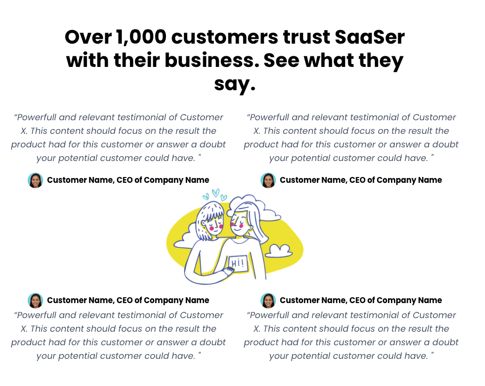

> All of the content you need is already included in the testimonials table, so give yourself a challenge and see if you can create this on your own. 


While you're trying new things, Next.js recently came out with `v11.0.0` which introduced several image support enhancements such as blurred placeholders. If you'd like I suggest upgrading the project to use `v.11.0.0`.  Try to challenge yourself [and add blurred image placeholders to your project](https://nextjs.org/docs/api-reference/next/image#placeholder).


Finally, we've only used CSS Modules for styling our components in this entire project, I would highly recommend trying some other framework or methodology for your own projects. I personally prefer [Chakra-UI](https://chakra-ui.com/) whenever possible. The team at Chakra does a great job of creating really useful defaults for components with very thoughtful variants. I'll be doing a few articles on Chakra in the coming weeks, so be sure to follow if you're interested in that. 


If you have any questions, issues, or just want to reach out you can feel free to hit me up on **Twitter**: @[soham_asmi](https://twitter.com/Soham_Asmi) or feel free to leave me a comment here and I'll do my best to help in any way I can. 

Thank you once again, and Happy Coding! 


