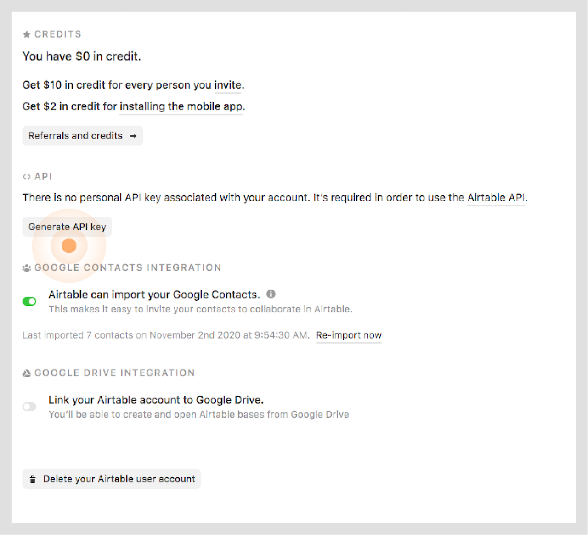

# Turn Airtable into a Scalable CMS with Sync Inc. and Next.js

## Introduction

Let's build a fully optimized landing page using [Airtable](https://airtable.com/) and [Next.js](https://nextjs.org/). Over the course of this 3-part series, you'll work your way up to building a highly scalable landing page with an easy-to-use custom Airtable CMS.

In this first post, we'll begin, with a general overview of Airtable and Next.js and why the combination makes an ideal solution for several real-world applications. You'll also learn how to configure an Airtable "[base](https://airtable.com/developers/scripting/api/base)" and integrate it with Next.js using [static site generation (SSG)](https://nextjs.org/docs/basic-features/pages#static-generation-recommended).

In the rest of the series, you'll see how you can simplify the solution and scale using [Sync Inc](https://syncinc.so). Which provides a synchronized cloud-based Postgres instance so you can run raw SQL queries against your Airtable data.

### What We're Building

In this first post, we'll build a simple yet versatile Splash page. Splash pages used to be more common in the past, but we still see remnants of them in modern applications. Splash pages generally are full-screen pages that are typically used for a single purpose, the most common example would be a 404 page.

#### The Brief

In our case, we're building a splash page for an up-and-coming Saas startup that provides uptime monitoring services. Our goal is to create an attractive "call-to-action" splash page to act as a placeholder while the full site and app are being built. This will help ensure the company can capture any early interest in their product and creates a list of followers who are enthusiastic about their upcoming launch.

By the end, you'll have a working, fully customizable splash page...

- built using Airtable as a CMS with [markdown support](https://support.airtable.com/hc/en-us/articles/360044741993-Markdown-syntax-for-Airtable-rich-text-formatting).
- statically generated by Next.js
- with built-in SEO support and image optimization.

Later in the series, you'll learn how you can:

- simplify the integration with [Sync Inc](https://www.syncinc.so).
- scale using a fully provisioned cloud Postgres database.
- leverage the power and simplicity of raw SQL queries.


> [Visit Splash Page Demo](https://preview.airtablecms.xyz/)

### What is Airtable?

Airtable is an online platform for managing and sharing relational data in an easy-to-use collaborative workspace. On the surface, Airtable looks like a fun spreadsheet but functions like a robust relational database and provides various tools, integrations, and automations that make it a very effective solution for most use-cases.

#### Why Airtable?

- Generous Free Tier
- Powerful Automations

### What is Next.js?

[Next.js](https://nextjs.org/) is a highly versatile, production-grade [React](https://reactjs.org/) framework. It provides thoughtful optimizations that just work such as a built-in CDN, server-less functions, and link prefetching. To take it one step further Next.js allows the developer to choose between static and server rendering on a per-page page basis.

#### Why Next.js?

- Super-fast performant websites and applications
- Optimized for production from the start
- Developer's choice: Static or Server Rendering
- Typescript and CSS Support

### Prerequisites

- Basic understanding of Javascript(ES6) and React.
- General understanding of relational databases, SQL statements and joins.
- **[System Requirements](https://nextjs.org/docs/getting-started#system-requirements)**
  - [Node.js 10.13](https://nodejs.org/) or later
  - Either macOS, Windows (including WSL), or Linux

## Resources

- [Airtable Base](https://airtable.com/shr5ukdwDwP7UHfXH) - This is the Airtable database you'll be working from.
- [Starter Repo](https://github.com/gaurangrshah/next-airtable-splash) - You can use this repo to clone our starter and follow along.
- [Finished Branch](https://github.com/gaurangrshah/next-airtable-splash/tree/post1) - Use this repo to compare your work if you run into any issues.
- [CodeSandbox Starter](https://codesandbox.io/s/starter-9qdvp) - You can also follow along using this CodeSandbox starter project.
- [Project Demo](https://preview.airtablecms.xyz/) - This is a working demo of the Splash page project from this post.

## Airtable Setup

First, let's get an Airtable base set up.

1. [Create an airtable account](https://airtable.com/signup) or [sign into your airtable account](https://airtable.com/login).
2. Then [click here to Clone the Airtable base](https://airtable.com/shr5ukdwDwP7UHfXH) you'll be using for this project.


### Airtable Credentials

Once you've cloned your base, you'll need both your Airtable `API key` and `base-id` to configure your application.

> **NOTE**: The `API key` should be treated as a secret and should be kept confidential. The `base-id` is semi-private, but for this project, we'll be treating it as a secret as well.

#### Generate API key

Let's start by generating your Airtable `API key`.

1. Click on your user icon in the top-right-hand corner.

   

2. From the drop-down menu select the "Account" option.

   

3. Under "Account Overview", click the button labeled "Generate API key".

   

> ⚠️ _Keep this `API key` secure, you'll need it when you configure your Next.js application._

#### Locate Base-Id

You can find your `base-id` from Airtable's live documentation.

1. From your base, click the "Help" button on the top-right of your screen.

   

2. From the sidebar menu, click the link labeled "API documentation".

   

3. You'll find your `base-id` listed right under the second paragraph in green:

   

> ☝️ Keep your `base-id` secure but available you'll need it to configure your Airtable base with your Next.js application.

Once you have your Airtable credentials, let's move on to setting up your Next.js application.

## Structuring Airtable as a CMS

If this is your first time using Airtable then this section will get you up to speed on some of the terminology and concepts you'll need to proceed.

The base you cloned is designed to be very flexible so you can always add fields to customize it once you're semi-familiar with how it functions.

Inside your base, you will find several tables listed at the top of the screen, (`pages`, `sections`, `blocks`, `media`, and `seo` ). These tables help us arrange our data logically in a way that resembles a spreadsheet, but functions like a relational database.


> As shown above, each **table in a base** consists of a collection of **rows** and each **row** represents an individual **record**. **Records** are a collection of **fields** that hold specific data about the object they represent. More about [Airtable structure](https://support.airtable.com/hc/en-us/articles/360021333094#table)

Airtable provides you with various [field types](https://support.airtable.com/hc/en-us/articles/360055885353-Field-types-reference) that can be used to store all kinds of values. For this project we'll only be using a few of the more common field types:

- **Single line text** - used to store small strings of text.
- **Number** - can be configured to hold integers or floating points.
- **Long text** - used for longer text content (_i.e., paragraphs_).
- **Single select** - select a single option from a predefined list.
- **Multiple select** - select multiple options from a predefined list.
- **Attachment** - used to store files.
- **Linked Records** - used to link a record from one table with another.

> **NOTE**: Even though all of this may seem like a lot, we're actually just scratching the surface here with Airtable. Luckily they have some incredible documentation both for the [platform](https://support.airtable.com/hc/en-us?utm_source=bing&utm_medium=cpc&utm_extra5=kwd-79783727595813:loc-190&utm_extra2=392687868&utm_extra10=1276533657989087&creative=&device=c&cx=us&targetid=kwd-79783727595813:loc-190&campaignid=392687868&adgroupid=1276533657989087&utm_campaign=brand_creator&utm_content=bofu_freetrial&msclkid=1d547cbc4d87108fb16b1c04138b88ae) and for the [API](https://airtable.com/api?utm_source=bing&utm_medium=cpc&utm_extra5=kwd-78890375930822:loc-190&utm_extra2=392687867&utm_extra10=1262240006362370&creative=&device=c&cx=us&targetid=kwd-78890375930822:loc-190&campaignid=392687867&adgroupid=1262240006362370&utm_campaign=brand_creator&utm_content=bofu_freetrial&msclkid=ed5c7b63058c199f44931bdb5baa686a).
>
> And if you really want to dive deep, I came across [this article](https://blog.syncinc.so/the-complete-developers-guide-to-airtable) that covers just about everything you can do with Airtable as a developer.

### Tables

We use Airtable's field types in our base to help organize our data, based on the type of values we want to accept for any given field. Let's take a deeper look at each field and the type of data it holds.

##### pages

| field       | field type       | description                                                                                   |
| ----------- | ---------------- | --------------------------------------------------------------------------------------------- |
| `title`     | single line text | represents the title for the current page and can be used to populate nav menus as needed.    |
| `path`      | single line text | used to populate the `href` value when linking to a page.                                     |
| `order`     | number           | used to control the order in which each page should be displayed (also useful for nav menus). |
| `sectionId` | linked record    | used to link to related sections for each page.                                               |
| `seoId`     | linked record    | used to link to SEO metadata for each page.                                                   |

##### sections

| field     | field type       | description                                                                                  |
| --------- | ---------------- | -------------------------------------------------------------------------------------------- |
| `title`   | single line text | represents the title for the section (_only used for reference purposes_).                   |
| `order`   | number           | used to control the order of each section (_on a per-page basis_).                           |
| `type`    | single select    | used to control which component the application will use to render each section.             |
| `filter`  | multiple select  | used as a boolean modifier that is useful for conditionally rendering components or layouts. |
| `blockId` | linked record    | used to link to related blocks for each section.                                             |
| `pageId`  | linked record    | used to link to the page that will render this section.                                      |

##### blocks

| field       | field type       | description                                                                          |
| ----------- | ---------------- | ------------------------------------------------------------------------------------ |
| `title`     | single line text | title for each block, used as the heading element's content. (_i.e., h1, h2, h3..._) |
| `lead`      | single line text | short text block that will be rendered above the heading tag in our application.     |
| `excerpt`   | single line text | short text block that will be rendered below the heading tag in our application.     |
| `content`   | long text        | long from content (_i.e., paragraph_) that will be rendered as a block of text.      |
| `mediaId`   | linked record    | used to link to related media for each block.                                        |
| `sectionId` | linked record    | used to link to the section that will render this block.                             |

##### media

| field     | field type       | description                                                                                        |
| --------- | ---------------- | -------------------------------------------------------------------------------------------------- |
| `title`   | single line text | represents the title for each media item (_only used for reference purposes_).                     |
| `url`     | attachment       | holds a file attachement as an object from which we use the url property.                          |
| `alt`     | single line text | used to populate the alt tag for each image.                                                       |
| `blockId` | linked record    | used to link to the block that will render each media item.                                        |
| `seoId`   | linked record    | can be used to reference an image from the `seo` table to be used as the `og:image` for each page. |

##### seo

| field         | field type       | description                                                               |
| ------------- | ---------------- | ------------------------------------------------------------------------- |
| `title`       | single line text | used to populate the `title` tag for each page.                           |
| `description` | single line text | used to populate the `description` tag.                                   |
| `keywords`    | single line text | used to populate the `keywords` tag.                                      |
| `sitename`    | linked record    | used to populate the `site_name` tag.                                     |
| `url`         | linked record    | used to populate the `site_url` tag.                                      |
| `pageId`      | linked record    | used to reference the page that each SEO record belongs to.               |
| `mediaId`     | linked record    | used to link to related media to be used as the `og:image` for each page. |

### Relationships

Since one of the pre-requisites of this post was an understanding of relational databases, we won't dive too deep into the following concept of relationships.


> In the diagram above you can see each table along with each of its fields and corresponding field types. You can also get a rough idea about how some of the fields are used to link data from different tables together.

At its core Airtable is a relational database. The platform abstracts away a lot of the relational complexity and provides an easy-to-use interface that resembles a spreadsheet instead. Under the hood, relational concepts such as the use of `primary` and `foreign` keys are implemented to link records of your Airtable base to one another across your different tables.

Airtable calls these types of fields `linked records`, but these types of records behave similarly to the way `foreign_keys` are implemented in relational databases.

> If you're not familiar with these relational database terms, I advise taking a quick second to skim through the introduction of [this article](https://www.guru99.com/difference-between-primary-key-and-foreign-key.html).
> And also more about [linked records](https://support.airtable.com/hc/en-us/articles/360021678853-The-power-of-Airtable-s-linked-records) in Airtable.

In Airtable the first field in each table acts similar to a `primary_key`. Airtable calls these fields the `primary field`. In your Airtable base, the first field on each table is the `title` field which essentially functions as the primary reference to the record it represents.

The contents of each `primary field` field get indexed by Airtable which means we can search for our records by their `title`.

> ☝️ **NOTE**: It's good practice to make sure the field that is used as the `primary_key` for each table has a unique value, although Airtable does not enforce this constraint. More about: [Airtable primary keys](https://support.airtable.com/hc/en-us/articles/202624179-The-primary-field)

**Naming Convention**

We have adopted a simple naming convention (from relational databases) for the naming of each of the `foreign_key` fields where the field is named as a combination `foreign_tablename` + "Id".

For example, on the `sections` table, the `pageId` field links to a page record so it's aptly named `pageId`.

This naming convention helps us address a disparity between how the Airtable UI presents data for `linked records` as a list of titles in our Airtable base versus how the API represents this same data as an array of unique ids.

**Airtable API Relationships**

Let's dig a bit further at the difference between how data looks in the Airtable UI versus in the Airtable API using a small chunk of the data in your new Airtable base.

The API response snippet shown below for the `sectionId` field returns an array of ids. Each id in the array represents a `linked record`.

> Airtable response for the `sectionId` field:
>
> ```
> "sectionId": [ "recTiTyzYFdayHJs5", "recm1iacYCQPuIseY", "recnJxlc90m0VYWeu" ]
> ```

> But in the Airtable UI, these same `linked records` appear as the `sectionId`:
> 

Ultimately, this behavior in the API makes sense. Matching and looking up IDs is better than working with ever changing strings.

Relationships can sometimes be tricky to reason about, but we're not doing anything complex here. As long as you have a general understanding of the basics you should feel confident enough to proceed.

## Next.js Setup

### Starter overview

The [starter repo](https://github.com/gaurangrshah/next-airtable-splash) is a boilerplate create-next-app with a single dependency added: [airtable.js](https://github.com/airtable/airtable.js/). All the styles needed for the entire project are included with the starter as CSS modules all located in the `/styles` directory.

There are a couple of pre-fabricated presentational components and a few helper methods also included with the starter repo. We'll go over each in a bit of detail, but first, let's set up the application.

Clone the [starter repo](https://github.com/gaurangrshah/next-airtable-splash) locally.

> ```bash
> $ git clone https://github.com/gaurangrshah/next-airtable-splash
> ```

### Add credentials

Now add your Airtable credentials as environment variables to your local repository. With Next.js you can simply create a file called `.env.local` at the root of your project. Next.js adds this file to your `.gitignore` by default and securely injects the variables into your environment at build time. More about: [Next.js Environment Variables](https://nextjs.org/docs/basic-features/environment-variables#loading-environment-variables)

```
# .env.local

AIRTABLE_API_KEY={{YOUR_AIRTABLE_API_KEY_HERE}}
AIRTABLE_BASE_ID={{YOUR_AIRTABLE_BASE_ID_HERE}}
```

Now that you have your application credentials configured go ahead and start your development server to make sure everything is working for you:

```bash
$ yarn dev
```

Now navigate to `http://localhost:3000/` . You should see the welcome message shown below.


And there you have it. Your Next.js application is now running locally and you've got your environment variables configured.

The next thing you'll want to do is configure your Airtable base to work with your Next.js application, but before we get there, let's take a moment to go over the structure of your Airtable base and how it will work as a CMS.

## Integrate Airtable

Now, connect your Airtable base to your Next.js app. You already have `airtable.js` included as a dependency in the `package.json` file of your Next.js application.


So we can jump right in and begin by instantiating an instance of Airtable in our project.

```js
// lib/airtable.js

const Airtable = require("airtable");
const { getMinifiedRecords, minifyRecord } = require("../utils/airtable");

// airtable queries are based on "views"
export const VIEW = "Grid view";

// instantiate airtable
export const table = new Airtable({
  apiKey: process.env.AIRTABLE_API_KEY,
});

// create reference to airtable base
export const base = table.base(process.env.AIRTABLE_BASE_ID);
```

Even though `airtable.js` provides a very easy-to-use wrapper around the Airtable REST API, working with Airtable data on the client-side can be a bit of a clunky process. To make querying the API easier, your starter includes several helper functions. These functions are used to help you interact with the API and make data handling a bit more manageable:

```js
// lib/airtable.js

// Airtable query helpers
export const getPage = async (
  page = "launch",
  table = "pages",
  options = { view: VIEW }
) => {
  // creates a filter allowing your to query your records by searching for matching title values.
  const filterByFormula = `AND(title='${page}')`;

  const records = await base(table)
    .select({ filterByFormula, ...options })
    .all();
  return getMinifiedRecords(records);
};

export const getRecordById = async (table, id) => {
  const record = await base(table).find(id);
  return minifyRecord(record);
};

export const getRelatedRecords = async (table, ids = []) => {
  const records = await ids.map(async (id) => {
    const record = await getRecordById(table, id);
    return record;
  });
  return Promise.all(records);
};
```

> `getPage()` is a helper function that hard-codes some default logic that you'll need for your queries (i.e, `table`, `page`) and provides the ability to pass in any additional options. This allows you to keep your logic extensible. We also make use of the `filterByFormula` option to target and select the data we need to render the `launch` page.
>
> ---
>
> `getRecordById()` is used to query a single record by its id.
>
> ---
>
> `getRelatedRecords()`is a function that takes in an array of ids. The function calls `getRecordById()` for each id in the array and returns the results as a single array of records.

Notice the helpers we defined reference two other utility functions `getMinifiedRecords()` and `minifyRecord`. These functions do not interact with the Airtable API themselves but are instead used to transform your Airtable records into data that is more manageable on the client-side.

```js
// utils/airtable.js

// maps over the records, calling minifyRecord, giving us required data
export const getMinifiedRecords = (records) => {
  if (!Array.isArray(records)) return minifyRecord(records);
  return records.map((record) => minifyRecord(record));
};

// gets the data we want and puts it into variables we can reference
export const minifyRecord = (record) => {
  return {
    id: record?.id,
    fields: record?.fields,
  };
};
```

> `minifyRecord()` takes a record from an Airtable response and only returns the data we need for our application. It strips away any helper methods and utility functions that are generally included on the response object by `airtable.js`.
>
> ---
>
> `getMinifiedRecords()` takes an array of Airtable response records and calls `minifyRecord()` for each one before returning the results.

With Airtable instantiated and your helper functions in place, you can turn your attention to using these helpers to fetch your Airtable data and use it to render static a page.

### Next.js Data-Fetching

Next.js supports several data fetching strategies out of the box. In this post, we'll be focusing on `getStaticProps()` which is how we create optimized static pages in Next.js.

### Static Site Generation (SSG)


`getStaticProps()` provides a way for you to query the file system or any external resources during the build process. This means its logic can be executed on the server at build time in your production environment and on each page load in your local development environment.`getStaticProps()` is an asynchronous function that can be exported from any top-level page component. Next.js will automatically execute this function at build time before generating the static page. More about: [getStaticProps()](https://nextjs.org/docs/basic-features/data-fetching#getstaticprops-static-generation)

> ⚠️ In development, you can always trigger a re-fetch with `getStaticProps()` by refreshing the page, but in production, you'll have to redeploy the application either manually from your hosting console or with a [deploy hook](https://vercel.com/docs/more/deploy-hooks).

> ☝️ **NOTE:** Next.js offers two additional data fetching strategies, [incremental static regeneration](https://nextjs.org/docs/basic-features/data-fetching#incremental-static-regeneration) (ISR), and traditional [server-side rendering](https://nextjs.org/docs/basic-features/data-fetching#getserversideprops-server-side-rendering) (SSR). Any of these features including static site generation (SSG) can be implemented on a per-page basis. This allows us as the developers to choose which strategy is right for each use case.

> For more about each strategy, I highly recommend [this article](https://mechandansinha.github.io/learning-nextjs-in-lockdown.html).

Now that you have an idea of what `getStaticProps()` can do, let's put it to work and use it to query data from your Airtable base.

```jsx
// pages/index.js

import Head from "next/head";
import styles from "../styles/Home.module.css";

export async function getStaticProps() {
  // asynchronously import neccessary modules so we can avoid any client side compilation
  const { getPage, getRecordById, getRelatedRecords } = await import(
    "../lib/airtable"
  );

  // query inital data from airtable
  const [launch] = await getPage("launch");

  // get related seo metadata
  if (launch?.fields?.seoId?.length) {
    const seo = await getRelatedRecords("seo", launch?.fields?.seoId);

    if (seo[0]?.fields?.mediaId.length) {
      // get related media for seo og:image
      const ogImage = await getRecordById("media", seo[0]?.fields?.mediaId[0]);
      seo[0].fields.ogImage = ogImage;
    }
    launch.seo = seo;
  }

  return {
    props: {
      page: launch?.id ? launch : [],
    },
  };
}

export default function Home({ page }) {
  return (
    <div className={styles.container}>
      <Head>
        <title>Create Next App</title>
        <link rel='icon' href='/favicon.ico' />
      </Head>

      <main className={styles.main}>
        <h1 className={styles.title}>
          Welcome to <a href='https://nextjs.org'>Next.js!</a>
        </h1>
        <div className={styles.card}>{JSON.stringify(page, null, 2)}</div>
      </main>
    </div>
  );
}
```

As you can see, we're only fetching a subset of our data and dumping it directly onto the page just to make sure everything is wired up properly. You should see your data dumped to the page as shown below.


It may not seem like it, but a lot of our logic is being handled by `getStaticProps()` so let's go over it step by step.

We first import any modules we need asynchronously inside of `getStaticProps()` this is a neat way to ensure that all of this logic only runs on the server at build time.

```js
// asynchronously import neccessary modules and avoid any client side evaluation
const { getPage, getRecordById, getRelatedRecords } = await import(
  "../lib/airtable"
);
```

Then we query Airtable for the launch page data using the `getPage()` helper function.

```js
// query inital data from airtable
const [launch] = await getPage("launch");
```

---

> Which (amongst the rest of the data) returns an array of ids for the `seoId` field. In this case, the array contains a single id linking to the `seo` table and pointing to the record with the `title` "Uptime Monitoring". Take a look at the image below as a refresher for how `pages` table is related to the `seo` table.


> **Recall:**
> that the `title` field shown above in the UI is represented as an id in the API response. The API response automatically substitutes the `title` value in `linked records` with unique ids instead.

---

We can use the `seoId` array to help us query Airtable once more for the related SEO record for your launch page.

```js
// get related seo metadata
if (launch?.fields?.seoId?.length) {
  const seo = await getRelatedRecords("seo", launch?.fields?.seoId);

  if (seo[0]?.fields?.mediaId.length) {
    // get related media for seo og:image
    const ogImage = await getRecordById("media", seo[0]?.fields?.mediaId[0]);
    seo[0].fields.ogImage = ogImage;
  }
  launch.seo = seo;
}
```

> We use the `seoId` array to fetch the related meta data for the `launch` page from the `seo` table. We also check if any media image exists so that we can use it as the `og:image` for the launch page..

Once we have our data we can return the entire `page` object as a prop from `getStaticProps()` which contains all of the related records from each of our responses.

```js
return {
  props: {
    page: launch?.id ? launch : [],
  },
};
```

Lastly, we access the `page` prop from our component and dump our data onto the page as JSON.

```jsx
export default function Home({ page }) {
  return (
    <div className={styles.container}>
      <Head>
        <title>Create Next App</title>
        <link rel='icon' href='/favicon.ico' />
      </Head>

      <main className={styles.main}>
        <h1 className={styles.title}>
          Welcome to <a href='https://nextjs.org'>Next.js!</a>
        </h1>
        <div className={styles.card}>{JSON.stringify(page, null, 2)}</div>
      </main>
    </div>
  );
}
```

Now that you understand how we're able to fetch data from Airtable with Next.js using `getStaticProps()`, let's take a look at how that data correlates to the structure of your application.


> The diagram below illustrates how each of the fields from your SEO table can be mapped to the corresponding meta tag in your application's HTML markup.

This allows you to make changes in your Airtable base and directly update the structure of your markup resembling the functionality of a CMS.

> **⚠️ Remember**: In development you will see new updates from your Airtable base with each page refresh, but in production, you'll need to rebuild and deploy your application in order to see any changes take effect.

Now that you have an idea of how we'll use the data from your Airtable base as a CMS to render out the initial structure of your application, we can turn our attention back to getting the rest of the related data you'll need to fully build out the Splash page.

We're going to do the same thing we did above to get the related SEO data, but we'll have to make several round trips to the Airtable API in order to get all of the data we need.

First, we'll need to query for all of the `sections` needed to render the `launch` page. Then we can iterate over each section to get the related `blocks` for each `section`. And while we're iterating, we'll need to do the same for any `media` image related to each `block`. We essentially return each responses - all while building up the final `page` object we'll use to render the application.

All of this logic will be handled within `getStaticProps()`. Similar to the way we queried for the SEO metadata.

```js
// pages/index.js

export async function getStaticProps() {
  // asynchronously import neccessary modules and avoid any client side evaluation
  const { getPage, getRecordById, getRelatedRecords } = await import(
    "../lib/airtable"
  );

  // query inital data from airtable
  const [launch] = await getPage("launch");

  // get related seo metadata
  if (launch?.fields?.seoId?.length) {
    const seo = await getRelatedRecords("seo", launch?.fields?.seoId);

    if (seo[0]?.fields?.mediaId.length) {
      // get related media for seo og:image
      const ogImage = await getRecordById("media", seo[0]?.fields?.mediaId[0]);
      seo[0].fields.ogImage = ogImage;
    }
    launch.seo = seo;
  }

  // get related data if there is any
  if (launch?.fields?.sectionId?.length) {
    const sections = await getRelatedRecords(
      "sections",
      launch?.fields?.sectionId
    );

    // get all blocks for each section and their related media
    if (sections?.length) {
      launch.sections = await Promise.all(
        await sections.map(async (section) => {
          if (section?.fields?.blockId?.length) {
            const blocks = await getRelatedRecords(
              "blocks",
              section?.fields?.blockId
            );
            if (blocks?.length) {
              section.blocks = await Promise.all(
                await blocks.map(async (block) => {
                  if (block?.fields?.mediaId?.length) {
                    const media = await getRelatedRecords(
                      "media",
                      block?.fields?.mediaId
                    );

                    if (media?.length) {
                      block.media = media;
                    }
                  }
                  return block;
                })
              );
            }
          }
          return section;
        })
      );
    }
  }

  return {
    props: {
      page: launch?.id ? launch : [],
    },
  };
}
```

> ☝️ **NOTE**: that once again we rely on the array of ids we get back from each of the linked record fields to then request each related record by id.

With this in place, you should now be seeing even more data being dumped onto your page as shown in the image below.


## Rendering Data From Airtable

Now that you already have all of your data dumped on the client-side of your application you can style and present it however you want to.

For this project, the starter comes with several pre-fabricated components that you can use to render this data. Let's take a look at how these components fit together to make up the structure of your application UI.


> As you can see from the diagram above, our index page renders the `Splash` component, which in turn is responsible for rendering each of the sections in your Splash page.

Each `section` from your Airtable base maps to a component in your application. We use the `type` field to determine which component renders each section. The image below shows an example of the mapping between your Airtable fields and the markup used to render them with the Hero component.


The first component your `Splash` component is responsible for rendering is the `Hero` component.

```jsx
// components/Hero.js

import styles from "../styles/Hero.module.css";
import Image from "next/image";

export const Hero = ({ data }) => {
  return (
    <div className={styles.hero}>
      <div className={styles.heroContent}>
        <p className={styles.lead}>{data[0]?.fields?.lead}</p>
        <h1 className={styles.heading}>{data[0]?.fields?.title}</h1>
        <p className={styles.excerpt}>{data[0]?.fields?.excerpt}</p>
      </div>
      {data[0]?.media?.length && (
        <div className={styles.heroImage}>
          <Image
            layout='intrinsic'
            src={data[0]?.media[0]?.fields?.url[0]?.url}
            alt={data[0]?.media[0]?.fields?.alt}
            objectFit='fill'
            width={600}
            height={600}
          />
        </div>
      )}
    </div>
  );
};
```

The `Hero` component simply renders a 2 column responsive flexbox layout. If you'll look closely at the markup you'll see that the hero component only accepts the`lead`, `heading`, and `excerpt` fields from your `blocks` table. It is not templated to render a `content` field. It will also render the related media image as well.

> You can take a look at the styles we use to achieve this layout in `styles/Hero.module.css`.
>
> **☝️ REMINDER**: All of the styles for each of the components included with the starter can be found in the `/styles` directory.

**Next.js Image Support**

Next.js recently introduced some really powerful image optimizations with their built-in Image component. One of the features we are using for the Hero component above is the `layout` prop with a value of `intrinsic` which simply tells Next.js to optimize this image with some basic responsiveness. More on [Next.js Image Props](https://nextjs.org/docs/api-reference/next/image).

> **⚠️ NOTE**: There is a caveat the Next.js image component works well out of the box with any images saved locally as an asset in your project to the `/public` directory, otherwise it needs us to define a domain for any external images so that it understands which domains to optimize for.
>
> This is done by extending the default next.js webpack configuration via a `next.config.js` file. Under the hood, Next.js will execute file this during the build process and optimize your package bundle with responsive variations of your image.
>
> ```js
> // next.config.js
>
> module.exports = {
>   images: {
>     domains: ["dl.airtable.com"],
>   },
> };
> ```
>
> With this in place, Next.js will know to optimize images from this domain. You can also list multiple domains if you're using several resources for image handling
>
> **⚠️ NOTE**: Your local server will need to be restarted after any changes to your `next.config.js` file.

Next, we have a `List` component that is used to render out a list of benefits with icons corresponding to each benefit.

```jsx
// components/List.js

import Image from "next/image";
import styles from "../styles/List.module.css";

export const List = ({ data, ...rest }) => {
  return (
    <ul className={styles.list}>
      {data?.map((block) => (
        <ListItem
          key={block?.id}
          className={styles.listItem}
          img={block?.media[0]?.fields}
          {...rest}
        >
          {block?.fields?.title}
        </ListItem>
      ))}
    </ul>
  );
};

export const ListItem = ({ img, filter = [], children }) => {
  return (
    <li className={styles.listItem}>
      {filter?.includes("withIcons") && (
        <span className={styles.icon}>
          <Image
            layout='intrinsic'
            src={img?.url[0].url}
            alt={img?.alt}
            width='28px'
            height='28px'
          />
        </span>
      )}
      {children}
    </li>
  );
};
```

> You'll also notice that we're rendering a `ListItem` for each benefit which includes an icon and some text for each. Each benefit is represented as its own `block` in AIrtable so we have to iterate over them to render each one out.

The next component we'll need is the `Cta` component which simply renders a standard signup form for updates regarding your launch.

```jsx
// components/Cta.js

import styles from "../styles/Cta.module.css";

export const Cta = ({ data, filter = [] }) => {
  const handleSubmit = (e) => {
    e.preventDefault();
    const input = e.target.querySelector("input");
    console.log(input.value);
  };

  return (
    <div className={styles.cta}>
      {data?.map((block) => (
        <div key={block?.id}>
          <h2>{block?.fields?.title}</h2>
          <p>{block?.fields?.excerpt}</p>
          {filter.includes("withForm") && (
            <form onSubmit={handleSubmit}>
              <div className={styles.inputGroup}>
                <input
                  type='email'
                  placeholder='you@youremail.com'
                  required
                  className={styles.input}
                />
                <div className={styles.inputRight}>
                  <button type='submit' className={styles.submit}>
                    Sign up now
                  </button>
                </div>
              </div>
            </form>
          )}
        </div>
      ))}
    </div>
  );
};
```

Although you have a bit more logic in this component, it's still quite simple.

> The component uses the `filter` field as a modifier to conditionally render a form. This helps us keep the Cta component extendable and reusable with several variations that can be applied from your Airtable response.

> For our use case the form simply prints the data out to the console, but you could just as easily send the data to a mailing list provider or other external resources.

The last component we'll need is the `Splash` component. This component iterates over the page's `sections` array and renders the appropriate section with the corresponding component.

```jsx
// components/Splash.js

import { Container, Wrapper, Row } from "./Containers";
import { Hero } from "./Hero";
import { List } from "./List";
import { Cta } from "./Cta";

const components = {
  list: List,
  cta: Cta,
};

export const Splash = ({ data }) => {
  if (!Array.isArray(data)) return null;
  const [hero, ...restComponents] = data;

  return (
    <Wrapper>
      <Container>
        {hero && (
          <Hero
            key={hero?.id}
            data={hero.blocks}
            filter={hero?.fields?.filter}
          />
        )}
        <Row>
          {restComponents.map((section) => {
            const Component = components[section?.fields?.type];

            if (section?.fields?.type.includes("list")) {
              return (
                <Component
                  key={`${section?.id}-${section?.order}`}
                  data={section?.blocks}
                  filter={section?.fields?.filter}
                />
              );
            }
            if (section?.fields?.type.includes("cta")) {
              return (
                <Component
                  key={`${section?.id}-${section?.order}`}
                  data={section?.blocks}
                  filter={section?.fields?.filter}
                />
              );
            }
            return null;
          })}
        </Row>
      </Container>
    </Wrapper>
  );
};
```

> The `Splash` component gives us some control over which components are used to render each section of our Airtable data. We use the `type` field to define the component that is used to render this section and the `filter` field to further add granular control by allowing conditional rendering logic.

There's one final thing left to do. You'll need to render the entire Splash component from `pages/index.js`.

```jsx
// pages/index.js

import Head from "next/head";

import { Splash } from "../components/Splash";
import styles from "../styles/Home.module.css";

export default function Home({ page }) {
  console.log();
  return (
    <div className={styles.pageWrapper}>
      <Head>
        <title>{page?.seo[0]?.fields?.title}</title>
        <meta name='viewport' content='initial-scale=1.0, width=device-width' />
        <meta name='description' content={page?.seo[0]?.fields?.description} />
        <meta property='og:title' content={page?.seo[0]?.fields?.title} />
        <meta
          property='og:site_name'
          content={page?.seo[0]?.fields?.sitename}
        />
        <meta property='og:url' content={page?.seo[0]?.fields?.url} />
        <meta
          property='og:description'
          content={page?.seo[0]?.fields?.description}
        />
        <meta
          property='og:image'
          content={page?.seo[0]?.fields?.ogImage?.fields?.url[0]?.url}
        />
        <link rel='icon' href='/favicon.ico' />
        <link rel='cannonical' href={page?.seo[0]?.fields?.url} />
      </Head>

      <main className={styles.main}>
        <Splash data={page?.sections} />
      </main>
    </div>
  );
}
```

> All you have to do pass down your Airtable sections array into the Splash component as props and it handles the rest.
>
> **Also Note**: We've also implemented search engine optimization using data from our Airtable `seo` table. This is just a basic implementation and if you're looking for a more robust solution I highly recommend using [next-seo](https://github.com/garmeeh/next-seo) for projects that need a more extensible SEO implementation.

<iframe src="https://codesandbox.io/embed/checkpoint3-z54ns?fontsize=14&hidenavigation=1&theme=dark&view=preview"
style="width:100%; height:500px; border:0; border-radius: 4px; overflow:hidden;"
title="checkpoint3"
allow="accelerometer; ambient-light-sensor; camera; encrypted-media; geolocation; gyroscope; hid; microphone; midi; payment; usb; vr; xr-spatial-tracking"
sandbox="allow-forms allow-modals allow-popups allow-presentation allow-same-origin allow-scripts"

> </iframe>

## Summary

That's it for the first part of the series. I imagine this was a lot to take in, but let's take a quick look at how far we've come in just the first part of our series.

So far you've learned how to implement a custom CMS for your Splash page using Airtable. You also got a close look at how Next.js gives you the ability to perform server-side operations even with static pages at build time making it a great choice for this use case. And we also covered how you can use Next.js for some really simple image optimization.

### Next Steps

You've already accomplished a lot already, but I would advise opening up your Airtable base, and from the blocks table start to edit some of your content. You should be able to see your changes reflected in your application after each page load just like you would with any CMS.

Next I'd suggest playing around with the application, and and adding a new section to it. Something like a "founder's message" seems like a good fit.

In the next part of this series, we'll go even further, and take a look at how we can use [Sync Inc](https://syncinc.so/) to synchronize our Airtable base with a cloud Postgres instance. This not only gives your application enterprise-grade scalability but also opens your application up to tons of possibilities including the ability to query your Airtable data with the power and flexibility of raw SQL queries.

So join us for the next installment and be sure to follow me on [twitter: @soham_asmi](https://sw.ink/Q2BJRE4ERM) to stay up to date with my latest posts and reach out to me with any feedback or questions.

Until next the next one... 👋 !
